# Polyglot Codebase Knowledge Graph

> Generated offline by **readmenator**. 13 files, 299 symbols, 59 imports. Supports C, C++, Python, Go, Rust, JS/TS, Java, C#, Shell, PHP, Dart, GDScript, Nim, ASM, Ruby, Swift, Kotlin, Scala, Lua, Elixir.
> No LLMs. No tokens. Pure static analysis. See more [here](https://github.com/grisuno/ReadMenator)

**Start here:** Statistics Dashboard for scope, God Nodes for blast radius, Architecture Reference for per-file API. Agents: prefer `readmenator-agent/INDEX.md` + `SYMBOLS.md`.

**Wiki:** prefer `readmenator-wiki/index.md` for progressive disclosure: one synthesis page per community, `connections.json` with EXTRACTED vs INFERRED confidence, `queries.md` log, `REPORT.md` audit.

**Confidence:** EXTRACTED = parsed from source, INFERRED = heuristic bridge, AMBIGUOUS = reported, never hidden. See `readmenator-wiki/REPORT.md`.

**Total Files Parsed:** 13 | **Total Symbols Extracted:** 299 | **Total Imports:** 59
 | **Resolved Imports:** 1

<!-- ranking_model: v1.0 | weights: {ppr:0.45,auth:0.2,test:0.15,doc:0.1,fresh:0.1} | alpha:0.85 | commit:05a4468 | date:2026-07-18 -->


## Table of Contents

1. [Statistics Dashboard](#statistics-dashboard)
2. [Architectural Layers](#architectural-layers)
3. [Ranked Context](#ranked-context)
4. [God Nodes](#god-nodes)
5. [Community Analysis](#community-analysis)
6. [Suggested Questions](#suggested-questions)
7. [Hotspot Analysis](#hotspot-analysis)
8. [Change Impact Analysis](#change-impact-analysis)
9. [Suggested Linting Rules](#suggested-linting-rules)
10. [Dataflow Analysis](#dataflow-analysis)
11. [Orphans](#orphans)
12. [Query Recipes](#query-recipes)
13. [Structural Knowledge Map](#structural-knowledge-map)
14. [UML Class Diagram](#uml-class-diagram)
15. [Code Property Graph](#code-property-graph)
16. [Architecture Reference](#architecture-reference)
    - [C (9 files)](#c-9-files)
    - [H (1 files)](#h-1-files)
    - [PY (2 files)](#py-2-files)
    - [SH (1 files)](#sh-1-files)

---

## Statistics Dashboard

| Metric | Value |
|--------|-------|
| Total Files | 13 |
| Total Symbols | 299 |
| Total Imports | 59 |
| Call Edges | 50 |
| Inheritance Edges | 0 |
| Languages | 4 |
| Avg Symbols/File | 23.0 |
| Avg Imports/File | 4.5 |
| Resolved Imports | 1 |

### Top Files by Import Count (Fan-Out)

| File | Imports | Symbols | Language |
|------|---------|---------|----------|
| `loader2.c` | 11 | 53 | c |
| `loader3.c` | 11 | 53 | c |
| `loader4.c` | 11 | 60 | c |
| `loader.c` | 8 | 43 | c |
| `crypter.py` | 6 | 3 | py |
| `aes.c` | 2 | 43 | c |
| `aes.h` | 2 | 21 | h |
| `lzss.c` | 2 | 14 | c |
| `pack.c` | 2 | 3 | c |
| `test.c` | 2 | 3 | c |

### Top Files by Imported-By Count (Fan-In)

| File | Imported By | Symbols | Language |
|------|-------------|---------|----------|
| `aes.h` | 1 | 21 | h |

---

## Architectural Layers

Auto-detected from path patterns, naming conventions, and imported frameworks.

| Layer | Files |
|-------|-------|
| utility | 12 |
| testing | 1 |

### utility

- `aes.c` (c, 43 symbols)
- `aes.h` (h, 21 symbols)
- `app.py` (py, 0 symbols)
- `crypter.py` (py, 3 symbols)
- `install.sh` (sh, 0 symbols)
- `loader.c` (c, 43 symbols)
- `loader2.c` (c, 53 symbols)
- `loader3.c` (c, 53 symbols)
- `loader4.c` (c, 60 symbols)
- `lzss.c` (c, 14 symbols)
- `pack.c` (c, 3 symbols)
- `unpack.c` (c, 3 symbols)

### testing

- `test.c` (c, 3 symbols)

---

## Ranked Context

Files ranked by composite score for the current query context. The ranking combines Personalized PageRank (query relevance), global authority, test coverage, documentation coverage, and code freshness. Model: v1.0.

| Rank | File | Composite | PPR | Authority | Test | Doc |
|------|------|-----------|-----|-----------|------|-----|
| 1 | `aes.h` | 0.4457 | 0.6491 | 0.6491 | 0.00 | 0.24 |
| 2 | `aes.c` | 0.2583 | 0.3509 | 0.3509 | 0.00 | 0.30 |
| 3 | `app.py` | 0.1000 | 0.0000 | 0.0000 | 0.00 | 1.00 |
| 4 | `test.c` | 0.0667 | 0.0000 | 0.0000 | 0.00 | 0.67 |
| 5 | `crypter.py` | 0.0333 | 0.0000 | 0.0000 | 0.00 | 0.33 |
| 6 | `pack.c` | 0.0333 | 0.0000 | 0.0000 | 0.00 | 0.33 |
| 7 | `unpack.c` | 0.0333 | 0.0000 | 0.0000 | 0.00 | 0.33 |
| 8 | `loader3.c` | 0.0170 | 0.0000 | 0.0000 | 0.00 | 0.17 |
| 9 | `loader4.c` | 0.0167 | 0.0000 | 0.0000 | 0.00 | 0.17 |
| 10 | `loader2.c` | 0.0132 | 0.0000 | 0.0000 | 0.00 | 0.13 |

---

## God Nodes

Most architecturally central files ranked by combined import/export degree and symbol richness.

| File | Score | Connections | PageRank |
|------|-------|-------------|----------|
| `aes.c` | 6.3 | | 0.3509 |
| `loader4.c` | 6.0 | | 0.0000 |
| `loader2.c` | 5.3 | | 0.0000 |
| `loader3.c` | 5.3 | | 0.0000 |
| `loader.c` | 4.3 | | 0.0000 |
| `aes.h` | 4.1 | | 0.6491 |
| `lzss.c` | 1.4 | | 0.0000 |
| `crypter.py` | 0.3 | | 0.0000 |
| `pack.c` | 0.3 | | 0.0000 |
| `test.c` | 0.3 | | 0.0000 |

---

## Community Analysis

Files grouped by import-based community detection. Cohesion measures how tightly connected each community is internally.

### root (Cohesion: 1.00)

**2 files** in this community:

- `aes.c` (c, 43 symbols)
- `aes.h` (h, 21 symbols)

---

## Suggested Questions

Auto-generated exploration prompts based on graph structure:

- What does aes.c depend on, and what depends on it? (1 connections)
- What does loader4.c depend on, and what depends on it? (0 connections)
- What does loader2.c depend on, and what depends on it? (0 connections)
- What is AES_ctx in aes.h and how is it used?
- What is the overall architecture of this codebase?

---

## Hotspot Analysis

Files ranked by combined complexity (symbol count) and centrality (connection count). High-scoring files are architecturally critical and may need refactoring attention.

| File | Complexity | Centrality | Combined | Symbols | Connections |
|------|-----------|------------|----------|---------|-------------|
| `aes.h` | 0.350 | 0.364 | 0.358 | 21 | 4 |
| `aes.c` | 0.717 | 0.273 | 0.450 | 43 | 3 |
| `app.py` | 0.000 | 0.000 | 0.000 | 0 | 0 |
| `test.c` | 0.050 | 0.182 | 0.129 | 3 | 2 |
| `crypter.py` | 0.050 | 0.545 | 0.347 | 3 | 6 |
| `pack.c` | 0.050 | 0.182 | 0.129 | 3 | 2 |
| `unpack.c` | 0.050 | 0.182 | 0.129 | 3 | 2 |
| `loader3.c` | 0.883 | 1.000 | 0.953 | 53 | 11 |
| `loader4.c` | 1.000 | 1.000 | 1.000 | 60 | 11 |
| `loader2.c` | 0.883 | 1.000 | 0.953 | 53 | 11 |
| `loader.c` | 0.717 | 0.727 | 0.723 | 43 | 8 |
| `lzss.c` | 0.233 | 0.182 | 0.202 | 14 | 2 |
| `install.sh` | 0.000 | 0.000 | 0.000 | 0 | 0 |

---

## Dataflow Analysis

Procedural intra-function dataflow findings (zero tokens, regex-based heuristics, all INFERRED). Each lead is grounded at file:line for manual review.

**8 findings** (UNCHECKED_ALLOC: 8).

| File | Function | Line | Kind | Variable | Description |
|------|----------|------|------|----------|-------------|
| `loader.c` | `main` | 809 | `UNCHECKED_ALLOC` | `whost` | Result of allocator stored in `whost` is never checked against NULL. |
| `loader.c` | `main` | 813 | `UNCHECKED_ALLOC` | `wresource` | Result of allocator stored in `wresource` is never checked against NULL. |
| `loader2.c` | `main` | 766 | `UNCHECKED_ALLOC` | `whost` | Result of allocator stored in `whost` is never checked against NULL. |
| `loader2.c` | `main` | 770 | `UNCHECKED_ALLOC` | `wresource` | Result of allocator stored in `wresource` is never checked against NULL. |
| `loader3.c` | `main` | 809 | `UNCHECKED_ALLOC` | `whost` | Result of allocator stored in `whost` is never checked against NULL. |
| `loader3.c` | `main` | 812 | `UNCHECKED_ALLOC` | `wresource` | Result of allocator stored in `wresource` is never checked against NULL. |
| `loader4.c` | `main` | 938 | `UNCHECKED_ALLOC` | `whost` | Result of allocator stored in `whost` is never checked against NULL. |
| `loader4.c` | `main` | 941 | `UNCHECKED_ALLOC` | `wresource` | Result of allocator stored in `wresource` is never checked against NULL. |

---

## Change Impact Analysis

Files sorted by how many other files would be affected if they changed. High-impact files should be changed with caution.

| File | Direct Dependents | Transitive Dependents | Total Impact |
|------|------------------|----------------------|--------------|
| `aes.h` | 1 | 0 | 1 |
| `aes.c` | 0 | 0 | 0 |
| `app.py` | 0 | 0 | 0 |
| `crypter.py` | 0 | 0 | 0 |
| `install.sh` | 0 | 0 | 0 |
| `loader.c` | 0 | 0 | 0 |
| `loader2.c` | 0 | 0 | 0 |
| `loader3.c` | 0 | 0 | 0 |
| `loader4.c` | 0 | 0 | 0 |
| `lzss.c` | 0 | 0 | 0 |
| `pack.c` | 0 | 0 | 0 |
| `test.c` | 0 | 0 | 0 |
| `unpack.c` | 0 | 0 | 0 |

---

## Suggested Linting Rules

Automatically suggested linting and security rules based on patterns detected in the codebase. These can be exported as Semgrep rules using the `--export-rules` flag.

| Rule ID | Severity | Description | Language | Matches |
|---------|----------|-------------|----------|---------|
| `RM001` | info | Large number of functions in c: 173 total | c | 173 |
| `RM002` | info | Large number of functions in h: 8 total | h | 8 |
| `RM003` | info | Large number of functions in py: 3 total | py | 3 |
| `RM004` | info | Print statement found (consider logging instead) | python | 16 |

---

## Orphans

Files with no documentation or low connectivity. These are candidates for documentation investment or cleanup.

- `install.sh` (0 symbols, no doc)

---

## Query Recipes

Example queries you can run against this knowledge base using the ranking engine:

```
# Find files most relevant to a concept
readmenator query "Where is the import resolver implemented?"

# Rank files by relevance to a topic
readmenator query "How does documentation generation work?"

# Explain why a file ranks highly
readmenator query "explain readmenator/_documentation.py"

# Trace dependency paths with ranked context
readmenator query "path from CLI to exporter"
```

The ranking model uses the following signals:

- **Personalized PageRank** (45% weight): query-specific relevance via seed propagation
- **Global Authority** (20% weight): structural importance via standard PageRank
- **Test Coverage** (15% weight): fraction of symbols referenced in test files
- **Doc Coverage** (10% weight): presence of docstrings and file-level docs
- **Freshness** (10% weight): recent modification activity

Results include score decomposition and justification paths for each ranked item.

---

## Structural Knowledge Map

```mermaid
graph TD
    classDef mod fill:#1e1e1e,stroke:#ff6666,stroke-width:2px,color:#fff;
    classDef cls fill:#2d2d2d,stroke:#4ec9b0,stroke-width:2px,color:#fff;
    classDef fn fill:#333,stroke:#dcdcaa,stroke-width:1px,color:#dcdcaa;
    classDef ext fill:#111,stroke:#666,stroke-dasharray:5 5,color:#aaa;
    loader4_c["loader4.c (c)"]
    class loader4_c mod;
    loader4_c_BitReader["BitReader"]
    class loader4_c_BitReader cls;
    loader4_c --> loader4_c_BitReader
    loader4_c_FluctuationMetadata["FluctuationMetadata"]
    class loader4_c_FluctuationMetadata cls;
    loader4_c --> loader4_c_FluctuationMetadata
    loader4_c_HookTrampolineBuffers["HookTrampolineBuffers"]
    class loader4_c_HookTrampolineBuffers cls;
    loader4_c --> loader4_c_HookTrampolineBuffers
    loader4_c_HookedSleep["HookedSleep"]
    class loader4_c_HookedSleep cls;
    loader4_c --> loader4_c_HookedSleep
    loader4_c_DATA["DATA"]
    class loader4_c_DATA cls;
    loader4_c --> loader4_c_DATA
    loader2_c["loader2.c (c)"]
    class loader2_c mod;
    loader3_c["loader3.c (c)"]
    class loader3_c mod;
    loader_c["loader.c (c)"]
    class loader_c mod;
    crypter_py["crypter.py (py)"]
    class crypter_py mod;
    subgraph community_0 ["root"]
    aes_c["aes.c (c)"]
    class aes_c mod;
    aes_h["aes.h (h)"]
    class aes_h mod;
    lzss_c["lzss.c (c)"]
    class lzss_c mod;
    pack_c["pack.c (c)"]
    class pack_c mod;
    test_c["test.c (c)"]
    class test_c mod;
    unpack_c["unpack.c (c)"]
    class unpack_c mod;
    app_py["app.py (py)"]
    class app_py mod;
    install_sh["install.sh (sh)"]
    class install_sh mod;
    end
    aes_c -- resolved_imports --> aes_h
    ext_aes_h["aes.h"]
    class ext_aes_h ext;
    aes_c -.->|imports| ext_aes_h
    ext_string_h["string.h"]
    class ext_string_h ext;
    aes_c -.->|imports| ext_string_h
    ext_stdint_h["stdint.h"]
    class ext_stdint_h ext;
    aes_h -.->|imports| ext_stdint_h
    ext_stddef_h["stddef.h"]
    class ext_stddef_h ext;
    aes_h -.->|imports| ext_stddef_h
    ext_sys["sys"]
    class ext_sys ext;
    crypter_py -.->|imports| ext_sys
    ext_os["os"]
    class ext_os ext;
    crypter_py -.->|imports| ext_os
    ext_hashlib["hashlib"]
    class ext_hashlib ext;
    crypter_py -.->|imports| ext_hashlib
    ext_struct["struct"]
    class ext_struct ext;
    crypter_py -.->|imports| ext_struct
    crypter_py -.->|imports| ext_os
    ext_Crypto_Cipher["Crypto.Cipher"]
    class ext_Crypto_Cipher ext;
    crypter_py -.->|imports| ext_Crypto_Cipher
    ext_windows_h["windows.h"]
    class ext_windows_h ext;
    loader_c -.->|imports| ext_windows_h
    ext_stdio_h["stdio.h"]
    class ext_stdio_h ext;
    loader_c -.->|imports| ext_stdio_h
    ext_psapi_h["psapi.h"]
    class ext_psapi_h ext;
    loader_c -.->|imports| ext_psapi_h
    ext_winternl_h["winternl.h"]
    class ext_winternl_h ext;
    loader_c -.->|imports| ext_winternl_h
    ext_winhttp_h["winhttp.h"]
    class ext_winhttp_h ext;
    loader_c -.->|imports| ext_winhttp_h
    ext_wincrypt_h["wincrypt.h"]
    class ext_wincrypt_h ext;
    loader_c -.->|imports| ext_wincrypt_h
    ext_stdlib_h["stdlib.h"]
    class ext_stdlib_h ext;
    loader_c -.->|imports| ext_stdlib_h
    loader_c -.->|imports| ext_string_h
    loader2_c -.->|imports| ext_windows_h
    loader2_c -.->|imports| ext_stdio_h
    loader2_c -.->|imports| ext_stdlib_h
    loader2_c -.->|imports| ext_string_h
    loader2_c -.->|imports| ext_stdint_h
    ext_stdbool_h["stdbool.h"]
    class ext_stdbool_h ext;
    loader2_c -.->|imports| ext_stdbool_h
    loader2_c -.->|imports| ext_psapi_h
    loader2_c -.->|imports| ext_winternl_h
    loader2_c -.->|imports| ext_winhttp_h
    loader2_c -.->|imports| ext_wincrypt_h
    ext_shellapi_h["shellapi.h"]
    class ext_shellapi_h ext;
    loader2_c -.->|imports| ext_shellapi_h
    loader3_c -.->|imports| ext_windows_h
    loader3_c -.->|imports| ext_stdio_h
    loader3_c -.->|imports| ext_stdlib_h
    loader3_c -.->|imports| ext_string_h
    loader3_c -.->|imports| ext_stdint_h
    loader3_c -.->|imports| ext_stdbool_h
    loader3_c -.->|imports| ext_psapi_h
    loader3_c -.->|imports| ext_winternl_h
    loader3_c -.->|imports| ext_winhttp_h
    loader3_c -.->|imports| ext_wincrypt_h
    loader3_c -.->|imports| ext_shellapi_h
    loader4_c -.->|imports| ext_windows_h
    loader4_c -.->|imports| ext_stdio_h
    loader4_c -.->|imports| ext_stdlib_h
    loader4_c -.->|imports| ext_string_h
    loader4_c -.->|imports| ext_stdint_h
    loader4_c -.->|imports| ext_stdbool_h
    loader4_c -.->|imports| ext_psapi_h
    loader4_c -.->|imports| ext_winternl_h
    loader4_c -.->|imports| ext_winhttp_h
    loader4_c -.->|imports| ext_wincrypt_h
    loader4_c -.->|imports| ext_shellapi_h
    lzss_c -.->|imports| ext_stdio_h
    lzss_c -.->|imports| ext_stdlib_h
    pack_c -.->|imports| ext_stdio_h
    pack_c -.->|imports| ext_stdlib_h
    test_c -.->|imports| ext_stdio_h
    test_c -.->|imports| ext_stdlib_h
    unpack_c -.->|imports| ext_stdio_h
    unpack_c -.->|imports| ext_stdlib_h
```



---

## UML Class Diagram

Auto-generated Mermaid class diagram from parsed class-level symbols. Shows classes, structs, interfaces, traits, and their methods with inheritance and dependency relationships.

```mermaid
classDiagram
  class aes_h_AES_ctx {
    <<struct>>
    +AES_init_ctx(struct AES_ctx* ctx, const uint8_t* key);
    +AES_init_ctx_iv(struct AES_ctx* ctx, const uint8_t* key, const uint8_t* iv);
    +AES_ctx_set_iv(struct AES_ctx* ctx, const uint8_t* iv);
    +AES_ECB_encrypt(const struct AES_ctx* ctx, uint8_t* buf);
    +AES_ECB_decrypt(const struct AES_ctx* ctx, uint8_t* buf);
    +AES_CBC_encrypt_buffer(struct AES_ctx* ctx, uint8_t* buf, size_t length);
    +AES_CBC_decrypt_buffer(struct AES_ctx* ctx, uint8_t* buf, size_t length);
    +AES_CTR_xcrypt_buffer(struct AES_ctx* ctx, uint8_t* buf, size_t length);
  }
  class loader_c__BASE_RELOCATION_ENTRY {
    <<struct>>
    +read_bit(BitReader* br)
    +read_bits(BitReader* br, int n)
    +lzss_decode_mem(const unsigned char* input, size_t input_size, unsigned char** output, size_...
    +hookGetCommandLineW()
    +hookGetCommandLineA()
    +hook__p___argv(void)
    +hook__p___wargv(void)
    +hook__p___argc(void)
    +anti_analysis()
    +selfDestruct()
  }
  class loader_c_DATA {
    <<struct>>
    +read_bit(BitReader* br)
    +read_bits(BitReader* br, int n)
    +lzss_decode_mem(const unsigned char* input, size_t input_size, unsigned char** output, size_...
    +hookGetCommandLineW()
    +hookGetCommandLineA()
    +hook__p___argv(void)
    +hook__p___wargv(void)
    +hook__p___argc(void)
    +anti_analysis()
    +selfDestruct()
  }
  class loader_c_BitReader {
    <<struct>>
    +read_bit(BitReader* br)
    +read_bits(BitReader* br, int n)
    +lzss_decode_mem(const unsigned char* input, size_t input_size, unsigned char** output, size_...
    +hookGetCommandLineW()
    +hookGetCommandLineA()
    +hook__p___argv(void)
    +hook__p___wargv(void)
    +hook__p___argc(void)
    +anti_analysis()
    +selfDestruct()
  }
  class loader2_c_BitReader {
    <<struct>>
    +read_bit(BitReader* br)
    +read_bits(BitReader* br, int n)
    +DecryptAES(char* data, DWORD* pDataLen, char* key, DWORD keyLen)
    +get_return_address(void)
    +xor32(uint8_t *buf, SIZE_T sz, uint32_t key)
    +isShellcodeThread(LPVOID addr)
    +shellcodeEncryptDecrypt(LPVOID caller)
    +MySleep(DWORD ms)
    +fastTrampoline(bool install, BYTE *target, LPVOID jump, HookTrampolineBuffers *b)
    +VEHHandler(PEXCEPTION_POINTERS xp)
  }
  class loader2_c_FluctuationMetadata {
    <<struct>>
    +read_bit(BitReader* br)
    +read_bits(BitReader* br, int n)
    +DecryptAES(char* data, DWORD* pDataLen, char* key, DWORD keyLen)
    +get_return_address(void)
    +xor32(uint8_t *buf, SIZE_T sz, uint32_t key)
    +isShellcodeThread(LPVOID addr)
    +shellcodeEncryptDecrypt(LPVOID caller)
    +MySleep(DWORD ms)
    +fastTrampoline(bool install, BYTE *target, LPVOID jump, HookTrampolineBuffers *b)
    +VEHHandler(PEXCEPTION_POINTERS xp)
  }
  class loader2_c_HookTrampolineBuffers {
    <<struct>>
    +read_bit(BitReader* br)
    +read_bits(BitReader* br, int n)
    +DecryptAES(char* data, DWORD* pDataLen, char* key, DWORD keyLen)
    +get_return_address(void)
    +xor32(uint8_t *buf, SIZE_T sz, uint32_t key)
    +isShellcodeThread(LPVOID addr)
    +shellcodeEncryptDecrypt(LPVOID caller)
    +MySleep(DWORD ms)
    +fastTrampoline(bool install, BYTE *target, LPVOID jump, HookTrampolineBuffers *b)
    +VEHHandler(PEXCEPTION_POINTERS xp)
  }
  class loader2_c_HookedSleep {
    <<struct>>
    +read_bit(BitReader* br)
    +read_bits(BitReader* br, int n)
    +DecryptAES(char* data, DWORD* pDataLen, char* key, DWORD keyLen)
    +get_return_address(void)
    +xor32(uint8_t *buf, SIZE_T sz, uint32_t key)
    +isShellcodeThread(LPVOID addr)
    +shellcodeEncryptDecrypt(LPVOID caller)
    +MySleep(DWORD ms)
    +fastTrampoline(bool install, BYTE *target, LPVOID jump, HookTrampolineBuffers *b)
    +VEHHandler(PEXCEPTION_POINTERS xp)
  }
  class loader2_c_DATA {
    <<struct>>
    +read_bit(BitReader* br)
    +read_bits(BitReader* br, int n)
    +DecryptAES(char* data, DWORD* pDataLen, char* key, DWORD keyLen)
    +get_return_address(void)
    +xor32(uint8_t *buf, SIZE_T sz, uint32_t key)
    +isShellcodeThread(LPVOID addr)
    +shellcodeEncryptDecrypt(LPVOID caller)
    +MySleep(DWORD ms)
    +fastTrampoline(bool install, BYTE *target, LPVOID jump, HookTrampolineBuffers *b)
    +VEHHandler(PEXCEPTION_POINTERS xp)
  }
  class loader3_c_BitReader {
    <<struct>>
    +read_bit(BitReader* br)
    +read_bits(BitReader* br, int n)
    +lzss_decode_mem(const unsigned char* input, size_t input_size, unsigned char** output, size_...
    +DecryptAES(char* data, DWORD* pDataLen, char* key, DWORD keyLen)
    +get_return_address(void)
    +xor32(uint8_t *buf, SIZE_T sz, uint32_t key)
    +isShellcodeThread(LPVOID addr)
    +shellcodeEncryptDecrypt(LPVOID caller)
    +MySleep(DWORD ms)
    +fastTrampoline(bool install, BYTE *target, LPVOID jump, HookTrampolineBuffers *b)
  }
  class loader3_c_FluctuationMetadata {
    <<struct>>
    +read_bit(BitReader* br)
    +read_bits(BitReader* br, int n)
    +lzss_decode_mem(const unsigned char* input, size_t input_size, unsigned char** output, size_...
    +DecryptAES(char* data, DWORD* pDataLen, char* key, DWORD keyLen)
    +get_return_address(void)
    +xor32(uint8_t *buf, SIZE_T sz, uint32_t key)
    +isShellcodeThread(LPVOID addr)
    +shellcodeEncryptDecrypt(LPVOID caller)
    +MySleep(DWORD ms)
    +fastTrampoline(bool install, BYTE *target, LPVOID jump, HookTrampolineBuffers *b)
  }
  class loader3_c_HookTrampolineBuffers {
    <<struct>>
    +read_bit(BitReader* br)
    +read_bits(BitReader* br, int n)
    +lzss_decode_mem(const unsigned char* input, size_t input_size, unsigned char** output, size_...
    +DecryptAES(char* data, DWORD* pDataLen, char* key, DWORD keyLen)
    +get_return_address(void)
    +xor32(uint8_t *buf, SIZE_T sz, uint32_t key)
    +isShellcodeThread(LPVOID addr)
    +shellcodeEncryptDecrypt(LPVOID caller)
    +MySleep(DWORD ms)
    +fastTrampoline(bool install, BYTE *target, LPVOID jump, HookTrampolineBuffers *b)
  }
  class loader3_c_HookedSleep {
    <<struct>>
    +read_bit(BitReader* br)
    +read_bits(BitReader* br, int n)
    +lzss_decode_mem(const unsigned char* input, size_t input_size, unsigned char** output, size_...
    +DecryptAES(char* data, DWORD* pDataLen, char* key, DWORD keyLen)
    +get_return_address(void)
    +xor32(uint8_t *buf, SIZE_T sz, uint32_t key)
    +isShellcodeThread(LPVOID addr)
    +shellcodeEncryptDecrypt(LPVOID caller)
    +MySleep(DWORD ms)
    +fastTrampoline(bool install, BYTE *target, LPVOID jump, HookTrampolineBuffers *b)
  }
  class loader3_c_DATA {
    <<struct>>
    +read_bit(BitReader* br)
    +read_bits(BitReader* br, int n)
    +lzss_decode_mem(const unsigned char* input, size_t input_size, unsigned char** output, size_...
    +DecryptAES(char* data, DWORD* pDataLen, char* key, DWORD keyLen)
    +get_return_address(void)
    +xor32(uint8_t *buf, SIZE_T sz, uint32_t key)
    +isShellcodeThread(LPVOID addr)
    +shellcodeEncryptDecrypt(LPVOID caller)
    +MySleep(DWORD ms)
    +fastTrampoline(bool install, BYTE *target, LPVOID jump, HookTrampolineBuffers *b)
  }
  class loader4_c_BitReader {
    <<struct>>
    +read_bit(BitReader* br)
    +read_bits(BitReader* br, int n)
    +deobf(const char* src, char* dst, size_t max_len)
    +SetHWBP_NtContinue(PVOID targetAddr, DWORD index)
    +lzss_decode_mem(const unsigned char* input, size_t input_size, unsigned char** output, size_...
    +PatchETW()
    +DecryptAES(char* data, DWORD* pDataLen, char* key, DWORD keyLen)
    +get_return_address(void)
    +xor32(uint8_t *buf, SIZE_T sz, uint32_t key)
    +isShellcodeThread(LPVOID addr)
  }
  class loader4_c_FluctuationMetadata {
    <<struct>>
    +read_bit(BitReader* br)
    +read_bits(BitReader* br, int n)
    +deobf(const char* src, char* dst, size_t max_len)
    +SetHWBP_NtContinue(PVOID targetAddr, DWORD index)
    +lzss_decode_mem(const unsigned char* input, size_t input_size, unsigned char** output, size_...
    +PatchETW()
    +DecryptAES(char* data, DWORD* pDataLen, char* key, DWORD keyLen)
    +get_return_address(void)
    +xor32(uint8_t *buf, SIZE_T sz, uint32_t key)
    +isShellcodeThread(LPVOID addr)
  }
  class loader4_c_HookTrampolineBuffers {
    <<struct>>
    +read_bit(BitReader* br)
    +read_bits(BitReader* br, int n)
    +deobf(const char* src, char* dst, size_t max_len)
    +SetHWBP_NtContinue(PVOID targetAddr, DWORD index)
    +lzss_decode_mem(const unsigned char* input, size_t input_size, unsigned char** output, size_...
    +PatchETW()
    +DecryptAES(char* data, DWORD* pDataLen, char* key, DWORD keyLen)
    +get_return_address(void)
    +xor32(uint8_t *buf, SIZE_T sz, uint32_t key)
    +isShellcodeThread(LPVOID addr)
  }
  class loader4_c_HookedSleep {
    <<struct>>
    +read_bit(BitReader* br)
    +read_bits(BitReader* br, int n)
    +deobf(const char* src, char* dst, size_t max_len)
    +SetHWBP_NtContinue(PVOID targetAddr, DWORD index)
    +lzss_decode_mem(const unsigned char* input, size_t input_size, unsigned char** output, size_...
    +PatchETW()
    +DecryptAES(char* data, DWORD* pDataLen, char* key, DWORD keyLen)
    +get_return_address(void)
    +xor32(uint8_t *buf, SIZE_T sz, uint32_t key)
    +isShellcodeThread(LPVOID addr)
  }
  class loader4_c_DATA {
    <<struct>>
    +read_bit(BitReader* br)
    +read_bits(BitReader* br, int n)
    +deobf(const char* src, char* dst, size_t max_len)
    +SetHWBP_NtContinue(PVOID targetAddr, DWORD index)
    +lzss_decode_mem(const unsigned char* input, size_t input_size, unsigned char** output, size_...
    +PatchETW()
    +DecryptAES(char* data, DWORD* pDataLen, char* key, DWORD keyLen)
    +get_return_address(void)
    +xor32(uint8_t *buf, SIZE_T sz, uint32_t key)
    +isShellcodeThread(LPVOID addr)
  }
```



---

## Code Property Graph

Machine-readable Code Property Graph (CPG) in JSON-LD format. This block allows AI agents to parse the full structural graph without additional file reads. Compatible with GraphRAG pipelines.

```json
{"@context": "https://schema.org", "analysis": {"communities": [{"cohesion": 1.0, "id": 0, "label": "root", "size": 2}], "god_nodes": [{"node_id": "aes.c", "score": 6.3}, {"node_id": "loader4.c", "score": 6.0}, {"node_id": "loader2.c", "score": 5.3}, {"node_id": "loader3.c", "score": 5.3}, {"node_id": "loader.c", "score": 4.3}, {"node_id": "aes.h", "score": 4.1}, {"node_id": "lzss.c", "score": 1.4}, {"node_id": "crypter.py", "score": 0.3}, {"node_id": "pack.c", "score": 0.3}, {"node_id": "test.c", "score": 0.3}], "surprising_connections": []}, "edges": [{"confidence": "EXTRACTED", "relation": "imports", "source": "aes.c", "target": "aes.h"}, {"confidence": "EXTRACTED", "relation": "imports", "source": "aes.c", "target": "string.h"}, {"confidence": "EXTRACTED", "relation": "imports", "source": "aes.h", "target": "stdint.h"}, {"confidence": "EXTRACTED", "relation": "imports", "source": "aes.h", "target": "stddef.h"}, {"confidence": "EXTRACTED", "relation": "imports", "source": "crypter.py", "target": "sys"}, {"confidence": "EXTRACTED", "relation": "imports", "source": "crypter.py", "target": "os"}, {"confidence": "EXTRACTED", "relation": "imports", "source": "crypter.py", "target": "hashlib"}, {"confidence": "EXTRACTED", "relation": "imports", "source": "crypter.py", "target": "struct"}, {"confidence": "EXTRACTED", "relation": "imports", "source": "crypter.py", "target": "os"}, {"confidence": "EXTRACTED", "relation": "imports", "source": "crypter.py", "target": "Crypto.Cipher"}, {"confidence": "EXTRACTED", "relation": "imports", "source": "loader.c", "target": "windows.h"}, {"confidence": "EXTRACTED", "relation": "imports", "source": "loader.c", "target": "stdio.h"}, {"confidence": "EXTRACTED", "relation": "imports", "source": "loader.c", "target": "psapi.h"}, {"confidence": "EXTRACTED", "relation": "imports", "source": "loader.c", "target": "winternl.h"}, {"confidence": "EXTRACTED", "relation": "imports", "source": "loader.c", "target": "winhttp.h"}, {"confidence": "EXTRACTED", "relation": "imports", "source": "loader.c", "target": "wincrypt.h"}, {"confidence": "EXTRACTED", "relation": "imports", "source": "loader.c", "target": "stdlib.h"}, {"confidence": "EXTRACTED", "relation": "imports", "source": "loader.c", "target": "string.h"}, {"confidence": "EXTRACTED", "relation": "imports", "source": "loader2.c", "target": "windows.h"}, {"confidence": "EXTRACTED", "relation": "imports", "source": "loader2.c", "target": "stdio.h"}, {"confidence": "EXTRACTED", "relation": "imports", "source": "loader2.c", "target": "stdlib.h"}, {"confidence": "EXTRACTED", "relation": "imports", "source": "loader2.c", "target": "string.h"}, {"confidence": "EXTRACTED", "relation": "imports", "source": "loader2.c", "target": "stdint.h"}, {"confidence": "EXTRACTED", "relation": "imports", "source": "loader2.c", "target": "stdbool.h"}, {"confidence": "EXTRACTED", "relation": "imports", "source": "loader2.c", "target": "psapi.h"}, {"confidence": "EXTRACTED", "relation": "imports", "source": "loader2.c", "target": "winternl.h"}, {"confidence": "EXTRACTED", "relation": "imports", "source": "loader2.c", "target": "winhttp.h"}, {"confidence": "EXTRACTED", "relation": "imports", "source": "loader2.c", "target": "wincrypt.h"}, {"confidence": "EXTRACTED", "relation": "imports", "source": "loader2.c", "target": "shellapi.h"}, {"confidence": "EXTRACTED", "relation": "imports", "source": "loader3.c", "target": "windows.h"}, {"confidence": "EXTRACTED", "relation": "imports", "source": "loader3.c", "target": "stdio.h"}, {"confidence": "EXTRACTED", "relation": "imports", "source": "loader3.c", "target": "stdlib.h"}, {"confidence": "EXTRACTED", "relation": "imports", "source": "loader3.c", "target": "string.h"}, {"confidence": "EXTRACTED", "relation": "imports", "source": "loader3.c", "target": "stdint.h"}, {"confidence": "EXTRACTED", "relation": "imports", "source": "loader3.c", "target": "stdbool.h"}, {"confidence": "EXTRACTED", "relation": "imports", "source": "loader3.c", "target": "psapi.h"}, {"confidence": "EXTRACTED", "relation": "imports", "source": "loader3.c", "target": "winternl.h"}, {"confidence": "EXTRACTED", "relation": "imports", "source": "loader3.c", "target": "winhttp.h"}, {"confidence": "EXTRACTED", "relation": "imports", "source": "loader3.c", "target": "wincrypt.h"}, {"confidence": "EXTRACTED", "relation": "imports", "source": "loader3.c", "target": "shellapi.h"}, {"confidence": "EXTRACTED", "relation": "imports", "source": "loader4.c", "target": "windows.h"}, {"confidence": "EXTRACTED", "relation": "imports", "source": "loader4.c", "target": "stdio.h"}, {"confidence": "EXTRACTED", "relation": "imports", "source": "loader4.c", "target": "stdlib.h"}, {"confidence": "EXTRACTED", "relation": "imports", "source": "loader4.c", "target": "string.h"}, {"confidence": "EXTRACTED", "relation": "imports", "source": "loader4.c", "target": "stdint.h"}, {"confidence": "EXTRACTED", "relation": "imports", "source": "loader4.c", "target": "stdbool.h"}, {"confidence": "EXTRACTED", "relation": "imports", "source": "loader4.c", "target": "psapi.h"}, {"confidence": "EXTRACTED", "relation": "imports", "source": "loader4.c", "target": "winternl.h"}, {"confidence": "EXTRACTED", "relation": "imports", "source": "loader4.c", "target": "winhttp.h"}, {"confidence": "EXTRACTED", "relation": "imports", "source": "loader4.c", "target": "wincrypt.h"}, {"confidence": "EXTRACTED", "relation": "imports", "source": "loader4.c", "target": "shellapi.h"}, {"confidence": "EXTRACTED", "relation": "imports", "source": "lzss.c", "target": "stdio.h"}, {"confidence": "EXTRACTED", "relation": "imports", "source": "lzss.c", "target": "stdlib.h"}, {"confidence": "EXTRACTED", "relation": "imports", "source": "pack.c", "target": "stdio.h"}, {"confidence": "EXTRACTED", "relation": "imports", "source": "pack.c", "target": "stdlib.h"}, {"confidence": "EXTRACTED", "relation": "imports", "source": "test.c", "target": "stdio.h"}, {"confidence": "EXTRACTED", "relation": "imports", "source": "test.c", "target": "stdlib.h"}, {"confidence": "EXTRACTED", "relation": "imports", "source": "unpack.c", "target": "stdio.h"}, {"confidence": "EXTRACTED", "relation": "imports", "source": "unpack.c", "target": "stdlib.h"}, {"confidence": "EXTRACTED", "relation": "resolved_imports", "source": "aes.c", "target": "aes.h"}], "generator": "readmenator", "metadata": {"edge_count": 110, "file_count": 13, "language_count": 4, "symbol_count": 299}, "nodes": [{"doc": "aes.c - tiny-AES-c (https://github.com/kokke/tiny-AES-c)", "id": "aes.c", "kind": "module", "label": "aes.c", "language": "c", "sha256": "12e247148b2d6453", "symbol_count": 43, "symbols": [{"kind": "function", "line": 13, "name": "getSBoxValue", "signature": "static uint8_t getSBoxValue(uint8_t num)"}, {"kind": "function", "line": 35, "name": "getSBoxInvert", "signature": "static uint8_t getSBoxInvert(uint8_t num)"}, {"kind": "function", "line": 57, "name": "Td0", "signature": "static uint8_t Td0(int x)"}, {"kind": "function", "line": 58, "name": "Td1", "signature": "static uint8_t Td1(int x)"}, {"kind": "function", "line": 59, "name": "Td2", "signature": "static uint8_t Td2(int x)"}, {"kind": "function", "line": 60, "name": "Td3", "signature": "static uint8_t Td3(int x)"}, {"kind": "function", "line": 61, "name": "Td4", "signature": "static uint8_t Td4(int x)"}, {"doc": "This function produces Nb(Nr+1) round keys. The round keys are used in each round to decrypt the states.", "kind": "function", "line": 166, "name": "KeyExpansion", "signature": "static void KeyExpansion(uint8_t* RoundKey, const uint8_t* Key)"}, {"kind": "function", "line": 239, "name": "AES_init_ctx", "signature": "void AES_init_ctx(struct AES_ctx* ctx, const uint8_t* key)"}, {"doc": "if (defined(CBC) && (CBC == 1)) || (defined(CTR) && (CTR == 1))", "kind": "function", "line": 244, "name": "AES_init_ctx_iv", "signature": "void AES_init_ctx_iv(struct AES_ctx* ctx, const uint8_t* key, const uint8_t* iv)"}, {"kind": "function", "line": 249, "name": "AES_ctx_set_iv", "signature": "void AES_ctx_set_iv(struct AES_ctx* ctx, const uint8_t* iv)"}, {"doc": "This function adds the round key to state. The round key is added to the state by an XOR function.", "kind": "function", "line": 257, "name": "AddRoundKey", "signature": "static void AddRoundKey(uint8_t round, state_t* state, const uint8_t* RoundKey)"}, {"doc": "The SubBytes Function Substitutes the values in the state matrix with values in an S-box.", "kind": "function", "line": 271, "name": "SubBytes", "signature": "static void SubBytes(state_t* state)"}, {"doc": "The ShiftRows() function shifts the rows in the state to the left. Each row is shifted with different offset. Offset = Row number. So the first row is not shifted.", "kind": "function", "line": 286, "name": "ShiftRows", "signature": "static void ShiftRows(state_t* state)"}, {"kind": "function", "line": 314, "name": "xtime", "signature": "static uint8_t xtime(uint8_t x)"}, {"doc": "MixColumns function mixes the columns of the state matrix", "kind": "function", "line": 320, "name": "MixColumns", "signature": "static void MixColumns(state_t* state)"}, {"doc": "Multiply is used to multiply numbers in the field GF(2^8) Note: The last call to xtime() is unneeded, but often ends up generating a smaller binary The compiler seems to be able to vectorize the operation better this way. See https://github.com/kokke/tiny-AES-c/pull/34 if MULTIPLY_AS_A_FUNCTION", "kind": "function", "line": 340, "name": "Multiply", "signature": "static uint8_t Multiply(uint8_t x, uint8_t y)"}, {"doc": "MixColumns function mixes the columns of the state matrix. The method used to multiply may be difficult to understand for the inexperienced. Please use the references to gain more information.", "kind": "function", "line": 370, "name": "InvMixColumns", "signature": "static void InvMixColumns(state_t* state)"}, {"doc": "The SubBytes Function Substitutes the values in the state matrix with values in an S-box.", "kind": "function", "line": 391, "name": "InvSubBytes", "signature": "static void InvSubBytes(state_t* state)"}, {"kind": "function", "line": 403, "name": "InvShiftRows", "signature": "static void InvShiftRows(state_t* state)"}, {"doc": "Cipher is the main function that encrypts the PlainText.", "kind": "function", "line": 433, "name": "Cipher", "signature": "static void Cipher(state_t* state, const uint8_t* RoundKey)"}, {"doc": "if (defined(CBC) && CBC == 1) || (defined(ECB) && ECB == 1)", "kind": "function", "line": 459, "name": "InvCipher", "signature": "static void InvCipher(state_t* state, const uint8_t* RoundKey)"}, {"kind": "function", "line": 490, "name": "AES_ECB_encrypt", "signature": "void AES_ECB_encrypt(const struct AES_ctx* ctx, uint8_t* buf)"}, {"kind": "function", "line": 496, "name": "AES_ECB_decrypt", "signature": "void AES_ECB_decrypt(const struct AES_ctx* ctx, uint8_t* buf)"}, {"kind": "function", "line": 512, "name": "XorWithIv", "signature": "static void XorWithIv(uint8_t* buf, const uint8_t* Iv)"}, {"kind": "function", "line": 521, "name": "AES_CBC_encrypt_buffer", "signature": "void AES_CBC_encrypt_buffer(struct AES_ctx *ctx, uint8_t* buf, size_t length)"}, {"kind": "function", "line": 536, "name": "AES_CBC_decrypt_buffer", "signature": "void AES_CBC_decrypt_buffer(struct AES_ctx* ctx, uint8_t* buf, size_t length)"}, {"doc": "XorWithIv(buf, ctx->Iv); memcpy(ctx->Iv, storeNextIv, AES_BLOCKLEN); buf += AES_BLOCKLEN; } } #endif // #if defined(CBC) && (CBC == 1) #if defined(CTR) && (CTR == 1) /* Symmetrical operation: same function for encrypting as for decrypting. Note any IV/nonce should never be reused with the same key", "kind": "function", "line": 558, "name": "AES_CTR_xcrypt_buffer", "signature": "void AES_CTR_xcrypt_buffer(struct AES_ctx* ctx, uint8_t* buf, size_t length)"}, {"kind": "macro", "line": 5, "name": "Nb", "signature": "#define Nb"}, {"kind": "macro", "line": 9, "name": "KEYLEN_256", "signature": "#define KEYLEN_256"}, {"kind": "macro", "line": 10, "name": "RKLENGTH", "signature": "#define RKLENGTH"}, {"kind": "macro", "line": 11, "name": "BLOCKLEN", "signature": "#define BLOCKLEN"}, {"kind": "macro", "line": 67, "name": "Nb", "signature": "#define Nb"}, {"kind": "macro", "line": 70, "name": "Nk", "signature": "#define Nk"}, {"kind": "macro", "line": 71, "name": "Nr", "signature": "#define Nr"}, {"kind": "macro", "line": 73, "name": "Nk", "signature": "#define Nk"}, {"kind": "macro", "line": 74, "name": "Nr", "signature": "#define Nr"}, {"kind": "macro", "line": 76, "name": "Nk", "signature": "#define Nk"}, {"kind": "macro", "line": 77, "name": "Nr", "signature": "#define Nr"}, {"kind": "macro", "line": 84, "name": "MULTIPLY_AS_A_FUNCTION", "signature": "#define MULTIPLY_AS_A_FUNCTION"}, {"kind": "macro", "line": 163, "name": "getSBoxValue", "signature": "#define getSBoxValue(num)"}, {"kind": "macro", "line": 349, "name": "Multiply", "signature": "#define Multiply(x, y)"}, {"kind": "macro", "line": 365, "name": "getSBoxInvert", "signature": "#define getSBoxInvert(num)"}]}, {"doc": "#define the macros below to 1/0 to enable/disable the mode of operation.", "id": "aes.h", "kind": "module", "label": "aes.h", "language": "h", "sha256": "e1e91ab2bbec246c", "symbol_count": 21, "symbols": [{"kind": "struct", "line": 33, "name": "AES_ctx"}, {"kind": "function", "line": 41, "name": "AES_init_ctx", "signature": "void AES_init_ctx(struct AES_ctx* ctx, const uint8_t* key);"}, {"doc": "if (defined(CBC) && (CBC == 1)) || (defined(CTR) && (CTR == 1))", "kind": "function", "line": 43, "name": "AES_init_ctx_iv", "signature": "void AES_init_ctx_iv(struct AES_ctx* ctx, const uint8_t* key, const uint8_t* iv);"}, {"kind": "function", "line": 44, "name": "AES_ctx_set_iv", "signature": "void AES_ctx_set_iv(struct AES_ctx* ctx, const uint8_t* iv);"}, {"doc": "if defined(ECB) && (ECB == 1)", "kind": "function", "line": 48, "name": "AES_ECB_encrypt", "signature": "void AES_ECB_encrypt(const struct AES_ctx* ctx, uint8_t* buf);"}, {"kind": "function", "line": 49, "name": "AES_ECB_decrypt", "signature": "void AES_ECB_decrypt(const struct AES_ctx* ctx, uint8_t* buf);"}, {"doc": "if defined(CBC) && (CBC == 1)", "kind": "function", "line": 53, "name": "AES_CBC_encrypt_buffer", "signature": "void AES_CBC_encrypt_buffer(struct AES_ctx* ctx, uint8_t* buf, size_t length);"}, {"kind": "function", "line": 54, "name": "AES_CBC_decrypt_buffer", "signature": "void AES_CBC_decrypt_buffer(struct AES_ctx* ctx, uint8_t* buf, size_t length);"}, {"doc": "if defined(CTR) && (CTR == 1)", "kind": "function", "line": 58, "name": "AES_CTR_xcrypt_buffer", "signature": "void AES_CTR_xcrypt_buffer(struct AES_ctx* ctx, uint8_t* buf, size_t length);"}, {"kind": "macro", "line": 2, "name": "_AES_H_", "signature": "#define _AES_H_"}, {"kind": "macro", "line": 9, "name": "CBC", "signature": "#define CBC"}, {"kind": "macro", "line": 12, "name": "ECB", "signature": "#define ECB"}, {"kind": "macro", "line": 15, "name": "CTR", "signature": "#define CTR"}, {"kind": "macro", "line": 18, "name": "AES256", "signature": "#define AES256"}, {"kind": "macro", "line": 20, "name": "AES_BLOCKLEN", "signature": "#define AES_BLOCKLEN"}, {"kind": "macro", "line": 23, "name": "AES_KEYLEN", "signature": "#define AES_KEYLEN"}, {"kind": "macro", "line": 24, "name": "AES_keyExpSize", "signature": "#define AES_keyExpSize"}, {"kind": "macro", "line": 26, "name": "AES_KEYLEN", "signature": "#define AES_KEYLEN"}, {"kind": "macro", "line": 27, "name": "AES_keyExpSize", "signature": "#define AES_keyExpSize"}, {"kind": "macro", "line": 29, "name": "AES_KEYLEN", "signature": "#define AES_KEYLEN"}, {"kind": "macro", "line": 30, "name": "AES_keyExpSize", "signature": "#define AES_keyExpSize"}]}, {"doc": "app.py  Autor: Gris Iscomeback Correo electrónico: grisiscomeback[at]gmail[dot]com Fecha de creación: xx/xx/xxxx Licencia: GPL v3  Descripción:", "id": "app.py", "kind": "module", "label": "app.py", "language": "py", "sha256": "57b21bdb023585b8", "symbol_count": 0, "symbols": []}, {"id": "crypter.py", "kind": "module", "label": "crypter.py", "language": "py", "sha256": "b3ded94a56b1e293", "symbol_count": 3, "symbols": [{"kind": "function", "line": 9, "name": "AESencrypt", "signature": "def AESencrypt(plaintext, key)"}, {"doc": "Reemplaza la extensión del archivo por una nueva (sin el punto).", "kind": "function", "line": 19, "name": "change_ext", "signature": "def change_ext(filename, new_ext)"}, {"kind": "function", "line": 24, "name": "main", "signature": "def main()"}]}, {"id": "install.sh", "kind": "module", "label": "install.sh", "language": "sh", "sha256": "c907d80fd6734993", "symbol_count": 0, "symbols": []}, {"id": "loader.c", "kind": "module", "label": "loader.c", "language": "c", "sha256": "2d2e519a7f25448e", "symbol_count": 43, "symbols": [{"kind": "struct", "line": 41, "name": "_BASE_RELOCATION_ENTRY"}, {"kind": "struct", "line": 46, "name": "DATA"}, {"kind": "struct", "line": 58, "name": "BitReader"}, {"doc": "pragma warning(disable: 4996) define _CRT_SECURE_NO_WARNINGS", "kind": "type_alias", "line": 38, "name": "NTSTATUS", "signature": "typedef LONG NTSTATUS;"}, {"kind": "type_alias", "line": 40, "name": "12", "signature": "typedef struct _BASE_RELOCATION_ENTRY { WORD Offset : 12;"}, {"kind": "function", "line": 64, "name": "read_bit", "signature": "static int read_bit(BitReader* br)"}, {"kind": "function", "line": 75, "name": "read_bits", "signature": "static int read_bits(BitReader* br, int n)"}, {"kind": "function", "line": 85, "name": "lzss_decode_mem", "signature": "BOOL lzss_decode_mem(const unsigned char* input, size_t input_size, unsigned char** output, size_..."}, {"doc": "Implementación de hooks", "kind": "function", "line": 217, "name": "hookGetCommandLineW", "signature": "LPWSTR hookGetCommandLineW()"}, {"kind": "function", "line": 218, "name": "hookGetCommandLineA", "signature": "LPSTR hookGetCommandLineA()"}, {"kind": "function", "line": 219, "name": "hook__p___argv", "signature": "char*** __cdecl hook__p___argv(void)"}, {"kind": "function", "line": 220, "name": "hook__p___wargv", "signature": "wchar_t*** __cdecl hook__p___wargv(void)"}, {"kind": "function", "line": 221, "name": "hook__p___argc", "signature": "int* __cdecl hook__p___argc(void)"}, {"doc": "=== ANTI-ANALYSIS ===", "kind": "function", "line": 226, "name": "anti_analysis", "signature": "BOOL anti_analysis()"}, {"doc": "Puff", "kind": "function", "line": 251, "name": "selfDestruct", "signature": "void selfDestruct()"}, {"kind": "function", "line": 307, "name": "hook__wgetmainargs", "signature": "int hook__wgetmainargs(int* _Argc, wchar_t*** _Argv, wchar_t*** _Env, int _useless_, void* _useless)"}, {"kind": "function", "line": 313, "name": "hook__getmainargs", "signature": "int hook__getmainargs(int* _Argc, char*** _Argv, char*** _Env, int _useless_, void* _useless)"}, {"kind": "function", "line": 319, "name": "hookexit", "signature": "int __cdecl hookexit(int status)"}, {"kind": "function", "line": 324, "name": "hookExitProcess", "signature": "void __stdcall hookExitProcess(UINT statuscode)"}, {"kind": "function", "line": 328, "name": "masqueradeCmdline", "signature": "void masqueradeCmdline()"}, {"kind": "function", "line": 366, "name": "freeargvA", "signature": "void freeargvA(char** array, int Argc)"}, {"kind": "function", "line": 374, "name": "freeargvW", "signature": "void freeargvW(wchar_t** array, int Argc)"}, {"kind": "function", "line": 382, "name": "GetNTHeaders", "signature": "char* GetNTHeaders(char* pe_buffer)"}, {"kind": "function", "line": 394, "name": "GetPEDirectory", "signature": "IMAGE_DATA_DIRECTORY* GetPEDirectory(PVOID pe_buffer, size_t dir_id)"}, {"kind": "function", "line": 404, "name": "RepairIAT", "signature": "BOOL RepairIAT(PVOID modulePtr)"}, {"kind": "function", "line": 458, "name": "_stricmp", "signature": "_stricmp(func_name, \"exit\") == 0 ||\n                    _stricmp(func_name, \"_Exit\") == 0 ||\n    ..."}, {"kind": "function", "line": 479, "name": "RunPE", "signature": "DWORD WINAPI RunPE(LPVOID lpParameter)"}, {"kind": "function", "line": 485, "name": "PELoader", "signature": "void PELoader(char* data, DWORD datasize)"}, {"kind": "function", "line": 559, "name": "getNtdll", "signature": "LPVOID getNtdll()"}, {"kind": "function", "line": 602, "name": "Unhook", "signature": "BOOL Unhook(LPVOID cleanNtdll)"}, {"kind": "function", "line": 638, "name": "DecryptAES", "signature": "void DecryptAES(char* data, DWORD* pDataLen, char* key, DWORD keyLen)"}, {"kind": "function", "line": 671, "name": "GetData", "signature": "DATA GetData(wchar_t* whost, DWORD port, wchar_t* wresource)"}, {"kind": "function", "line": 792, "name": "main", "signature": "int main(int argc, char** argv)"}, {"kind": "macro", "line": 19, "name": "_CRT_RAND_S", "signature": "#define _CRT_RAND_S"}, {"kind": "macro", "line": 30, "name": "NT_SUCCESS", "signature": "#define NT_SUCCESS(Status)"}, {"kind": "macro", "line": 33, "name": "NtCurrentThread", "signature": "#define NtCurrentThread()"}, {"kind": "macro", "line": 34, "name": "NtCurrentProcess", "signature": "#define NtCurrentProcess()"}, {"kind": "macro", "line": 37, "name": "_CRT_SECURE_NO_WARNINGS", "signature": "#define _CRT_SECURE_NO_WARNINGS"}, {"kind": "macro", "line": 52, "name": "EI", "signature": "#define EI"}, {"kind": "macro", "line": 53, "name": "EJ", "signature": "#define EJ"}, {"kind": "macro", "line": 54, "name": "P", "signature": "#define P"}, {"kind": "macro", "line": 55, "name": "N", "signature": "#define N"}, {"kind": "macro", "line": 56, "name": "F", "signature": "#define F"}]}, {"doc": "=== DECLARACIONES DE HOOKS ===", "id": "loader2.c", "kind": "module", "label": "loader2.c", "language": "c", "sha256": "d6708ee0d481cf27", "symbol_count": 53, "symbols": [{"kind": "struct", "line": 46, "name": "BitReader"}, {"kind": "struct", "line": 111, "name": "FluctuationMetadata"}, {"kind": "struct", "line": 119, "name": "HookTrampolineBuffers"}, {"kind": "struct", "line": 129, "name": "HookedSleep"}, {"kind": "struct", "line": 134, "name": "DATA"}, {"doc": "ifdef _WIN64", "kind": "type_alias", "line": 100, "name": "UPTR", "signature": "typedef UINT64 UPTR;"}, {"doc": "else", "kind": "type_alias", "line": 102, "name": "UPTR", "signature": "typedef UINT32 UPTR;"}, {"kind": "function", "line": 52, "name": "read_bit", "signature": "static int read_bit(BitReader* br)"}, {"kind": "function", "line": 61, "name": "read_bits", "signature": "static int read_bits(BitReader* br, int n)"}, {"kind": "function", "line": 71, "name": "DecryptAES", "signature": "void DecryptAES(char* data, DWORD* pDataLen, char* key, DWORD keyLen)"}, {"kind": "function", "line": 183, "name": "get_return_address", "signature": "static inline UPTR get_return_address(void)"}, {"kind": "function", "line": 187, "name": "xor32", "signature": "void xor32(uint8_t *buf, SIZE_T sz, uint32_t key)"}, {"doc": "Verifica si la dirección está dentro de .text", "kind": "function", "line": 195, "name": "isShellcodeThread", "signature": "bool isShellcodeThread(LPVOID addr)"}, {"doc": "Fluctuación: encripta/desencripta SOLO .text", "kind": "function", "line": 206, "name": "shellcodeEncryptDecrypt", "signature": "void shellcodeEncryptDecrypt(LPVOID caller)"}, {"doc": "Hook de Sleep: ya NO inicializa fluctuación (se hace en PELoader)", "kind": "function", "line": 246, "name": "MySleep", "signature": "static void WINAPI MySleep(DWORD ms)"}, {"kind": "function", "line": 262, "name": "fastTrampoline", "signature": "bool fastTrampoline(bool install, BYTE *target, LPVOID jump, HookTrampolineBuffers *b)"}, {"kind": "function", "line": 303, "name": "VEHHandler", "signature": "LONG NTAPI VEHHandler(PEXCEPTION_POINTERS xp)"}, {"kind": "function", "line": 324, "name": "lzss_decode_mem", "signature": "BOOL lzss_decode_mem(const unsigned char* input, size_t input_size, unsigned char** output, size_..."}, {"kind": "function", "line": 388, "name": "masqueradeCmdline", "signature": "void masqueradeCmdline()"}, {"kind": "function", "line": 419, "name": "GetNTHeaders", "signature": "char* GetNTHeaders(char* pe_buffer)"}, {"kind": "function", "line": 430, "name": "GetPEDirectory", "signature": "IMAGE_DATA_DIRECTORY* GetPEDirectory(PVOID pe_buffer, size_t dir_id)"}, {"kind": "function", "line": 439, "name": "RepairIAT", "signature": "BOOL RepairIAT(PVOID modulePtr)"}, {"doc": "Hooks", "kind": "function", "line": 490, "name": "hookGetCommandLineA", "signature": "LPSTR hookGetCommandLineA()"}, {"kind": "function", "line": 491, "name": "hookGetCommandLineW", "signature": "LPWSTR hookGetCommandLineW()"}, {"kind": "function", "line": 492, "name": "hook__p___argv", "signature": "char*** __cdecl hook__p___argv(void)"}, {"kind": "function", "line": 493, "name": "hook__p___wargv", "signature": "wchar_t*** __cdecl hook__p___wargv(void)"}, {"kind": "function", "line": 494, "name": "hook__p___argc", "signature": "int* __cdecl hook__p___argc(void)"}, {"kind": "function", "line": 495, "name": "hook__getmainargs", "signature": "int hook__getmainargs(int* _Argc, char*** _Argv, char*** _Env, int _useless_, void* _useless)"}, {"kind": "function", "line": 498, "name": "hook__wgetmainargs", "signature": "int hook__wgetmainargs(int* _Argc, wchar_t*** _Argv, wchar_t*** _Env, int _useless_, void* _useless)"}, {"kind": "function", "line": 501, "name": "hookExitProcess", "signature": "void __stdcall hookExitProcess(UINT statuscode)"}, {"kind": "function", "line": 503, "name": "RunPE", "signature": "DWORD WINAPI RunPE(LPVOID lpParameter)"}, {"kind": "function", "line": 509, "name": "PELoader", "signature": "void PELoader(char* data, DWORD datasize)"}, {"kind": "function", "line": 597, "name": "anti_analysis", "signature": "BOOL anti_analysis()"}, {"kind": "function", "line": 618, "name": "selfDestruct", "signature": "void selfDestruct()"}, {"kind": "function", "line": 647, "name": "GetData", "signature": "DATA GetData(wchar_t* whost, DWORD port, wchar_t* wresource)"}, {"kind": "function", "line": 732, "name": "main", "signature": "int main(int argc, char** argv)"}, {"kind": "function", "line": 169, "name": "freeargvA", "signature": "void freeargvA(char** array, int Argc);"}, {"kind": "function", "line": 170, "name": "freeargvW", "signature": "void freeargvW(wchar_t** array, int Argc);"}, {"kind": "macro", "line": 1, "name": "_CRT_RAND_S", "signature": "#define _CRT_RAND_S"}, {"kind": "macro", "line": 2, "name": "WIN32_LEAN_AND_MEAN", "signature": "#define WIN32_LEAN_AND_MEAN"}, {"kind": "macro", "line": 26, "name": "_CRT_SECURE_NO_WARNINGS", "signature": "#define _CRT_SECURE_NO_WARNINGS"}, {"kind": "macro", "line": 29, "name": "NT_SUCCESS", "signature": "#define NT_SUCCESS(Status)"}, {"kind": "macro", "line": 32, "name": "NtCurrentThread", "signature": "#define NtCurrentThread()"}, {"kind": "macro", "line": 33, "name": "NtCurrentProcess", "signature": "#define NtCurrentProcess()"}, {"kind": "macro", "line": 35, "name": "WIN32_LEAN_AND_MEAN", "signature": "#define WIN32_LEAN_AND_MEAN"}, {"kind": "macro", "line": 36, "name": "UNICODE", "signature": "#define UNICODE"}, {"kind": "macro", "line": 37, "name": "_UNICODE", "signature": "#define _UNICODE"}, {"kind": "macro", "line": 40, "name": "EI", "signature": "#define EI"}, {"kind": "macro", "line": 41, "name": "EJ", "signature": "#define EJ"}, {"kind": "macro", "line": 42, "name": "P", "signature": "#define P"}, {"kind": "macro", "line": 43, "name": "N", "signature": "#define N"}, {"kind": "macro", "line": 44, "name": "F", "signature": "#define F"}, {"kind": "macro", "line": 154, "name": "log", "signature": "#define log(...)"}]}, {"id": "loader3.c", "kind": "module", "label": "loader3.c", "language": "c", "sha256": "5c262bc2a209d5dc", "symbol_count": 53, "symbols": [{"kind": "struct", "line": 58, "name": "BitReader"}, {"kind": "struct", "line": 174, "name": "FluctuationMetadata"}, {"kind": "struct", "line": 182, "name": "HookTrampolineBuffers"}, {"kind": "struct", "line": 192, "name": "HookedSleep"}, {"kind": "struct", "line": 197, "name": "DATA"}, {"doc": "================== TYPEDEFS & STRUCTS ================== ifdef _WIN64", "kind": "type_alias", "line": 163, "name": "UPTR", "signature": "typedef UINT64 UPTR;"}, {"doc": "else", "kind": "type_alias", "line": 165, "name": "UPTR", "signature": "typedef UINT32 UPTR;"}, {"kind": "function", "line": 64, "name": "read_bit", "signature": "static int read_bit(BitReader* br)"}, {"kind": "function", "line": 73, "name": "read_bits", "signature": "static int read_bits(BitReader* br, int n)"}, {"kind": "function", "line": 83, "name": "lzss_decode_mem", "signature": "BOOL lzss_decode_mem(const unsigned char* input, size_t input_size, unsigned char** output, size_..."}, {"kind": "function", "line": 139, "name": "DecryptAES", "signature": "void DecryptAES(char* data, DWORD* pDataLen, char* key, DWORD keyLen)"}, {"doc": "================== FLUCTUATION IMPLEMENTATION ==================", "kind": "function", "line": 238, "name": "get_return_address", "signature": "static inline UPTR get_return_address(void)"}, {"kind": "function", "line": 242, "name": "xor32", "signature": "void xor32(uint8_t *buf, SIZE_T sz, uint32_t key)"}, {"kind": "function", "line": 249, "name": "isShellcodeThread", "signature": "bool isShellcodeThread(LPVOID addr)"}, {"kind": "function", "line": 258, "name": "shellcodeEncryptDecrypt", "signature": "void shellcodeEncryptDecrypt(LPVOID caller)"}, {"kind": "function", "line": 292, "name": "MySleep", "signature": "static void WINAPI MySleep(DWORD ms)"}, {"kind": "function", "line": 306, "name": "fastTrampoline", "signature": "bool fastTrampoline(bool install, BYTE *target, LPVOID jump, HookTrampolineBuffers *b)"}, {"kind": "function", "line": 342, "name": "VEHHandler", "signature": "LONG NTAPI VEHHandler(PEXCEPTION_POINTERS xp)"}, {"doc": "================== PE LOADER ==================", "kind": "function", "line": 360, "name": "masqueradeCmdline", "signature": "void masqueradeCmdline()"}, {"kind": "function", "line": 390, "name": "freeargvA", "signature": "void freeargvA(char** array, int Argc)"}, {"kind": "function", "line": 398, "name": "freeargvW", "signature": "void freeargvW(wchar_t** array, int Argc)"}, {"kind": "function", "line": 406, "name": "GetNTHeaders", "signature": "char* GetNTHeaders(char* pe_buffer)"}, {"kind": "function", "line": 417, "name": "GetPEDirectory", "signature": "IMAGE_DATA_DIRECTORY* GetPEDirectory(PVOID pe_buffer, size_t dir_id)"}, {"kind": "function", "line": 426, "name": "RepairIAT", "signature": "BOOL RepairIAT(PVOID modulePtr)"}, {"doc": "Hooks", "kind": "function", "line": 478, "name": "hookGetCommandLineA", "signature": "LPSTR hookGetCommandLineA()"}, {"kind": "function", "line": 479, "name": "hookGetCommandLineW", "signature": "LPWSTR hookGetCommandLineW()"}, {"kind": "function", "line": 480, "name": "hook__p___argv", "signature": "char*** __cdecl hook__p___argv(void)"}, {"kind": "function", "line": 481, "name": "hook__p___wargv", "signature": "wchar_t*** __cdecl hook__p___wargv(void)"}, {"kind": "function", "line": 482, "name": "hook__p___argc", "signature": "int* __cdecl hook__p___argc(void)"}, {"kind": "function", "line": 483, "name": "hook__getmainargs", "signature": "int hook__getmainargs(int* _Argc, char*** _Argv, char*** _Env, int _useless_, void* _useless)"}, {"kind": "function", "line": 486, "name": "hook__wgetmainargs", "signature": "int hook__wgetmainargs(int* _Argc, wchar_t*** _Argv, wchar_t*** _Env, int _useless_, void* _useless)"}, {"kind": "function", "line": 489, "name": "hookexit", "signature": "int __cdecl hookexit(int status)"}, {"kind": "function", "line": 493, "name": "hookExitProcess", "signature": "void __stdcall hookExitProcess(UINT statuscode)"}, {"kind": "function", "line": 497, "name": "RunPE", "signature": "DWORD WINAPI RunPE(LPVOID lpParameter)"}, {"kind": "function", "line": 503, "name": "PELoader", "signature": "void PELoader(char* data, DWORD datasize)"}, {"doc": "================== ANTI-ANALYSIS & CLEANUP ==================", "kind": "function", "line": 581, "name": "anti_analysis", "signature": "BOOL anti_analysis()"}, {"kind": "function", "line": 602, "name": "selfDestruct", "signature": "void selfDestruct()"}, {"doc": "================== UNHOOKING ==================", "kind": "function", "line": 629, "name": "getNtdll", "signature": "LPVOID getNtdll()"}, {"kind": "function", "line": 665, "name": "Unhook", "signature": "BOOL Unhook(LPVOID cleanNtdll)"}, {"doc": "================== NETWORK ==================", "kind": "function", "line": 689, "name": "GetData", "signature": "DATA GetData(wchar_t* whost, DWORD port, wchar_t* wresource)"}, {"doc": "================== MAIN ==================", "kind": "function", "line": 757, "name": "main", "signature": "int main(int argc, char** argv)"}, {"kind": "macro", "line": 16, "name": "_CRT_RAND_S", "signature": "#define _CRT_RAND_S"}, {"kind": "macro", "line": 17, "name": "WIN32_LEAN_AND_MEAN", "signature": "#define WIN32_LEAN_AND_MEAN"}, {"kind": "macro", "line": 42, "name": "_CRT_SECURE_NO_WARNINGS", "signature": "#define _CRT_SECURE_NO_WARNINGS"}, {"kind": "macro", "line": 45, "name": "NT_SUCCESS", "signature": "#define NT_SUCCESS(Status)"}, {"kind": "macro", "line": 48, "name": "NtCurrentThread", "signature": "#define NtCurrentThread()"}, {"kind": "macro", "line": 49, "name": "NtCurrentProcess", "signature": "#define NtCurrentProcess()"}, {"kind": "macro", "line": 52, "name": "EI", "signature": "#define EI"}, {"kind": "macro", "line": 53, "name": "EJ", "signature": "#define EJ"}, {"kind": "macro", "line": 54, "name": "P", "signature": "#define P"}, {"kind": "macro", "line": 55, "name": "N", "signature": "#define N"}, {"kind": "macro", "line": 56, "name": "F", "signature": "#define F"}, {"kind": "macro", "line": 214, "name": "log", "signature": "#define log(...)"}]}, {"id": "loader4.c", "kind": "module", "label": "loader4.c", "language": "c", "sha256": "999457cebca52227", "symbol_count": 60, "symbols": [{"kind": "struct", "line": 98, "name": "BitReader"}, {"kind": "struct", "line": 287, "name": "FluctuationMetadata"}, {"kind": "struct", "line": 295, "name": "HookTrampolineBuffers"}, {"kind": "struct", "line": 305, "name": "HookedSleep"}, {"kind": "struct", "line": 310, "name": "DATA"}, {"doc": "================== TYPEDEFS & STRUCTS ================== ifdef _WIN64", "kind": "type_alias", "line": 276, "name": "UPTR", "signature": "typedef UINT64 UPTR;"}, {"doc": "else", "kind": "type_alias", "line": 278, "name": "UPTR", "signature": "typedef UINT32 UPTR;"}, {"kind": "function", "line": 104, "name": "read_bit", "signature": "static int read_bit(BitReader* br)"}, {"kind": "function", "line": 113, "name": "read_bits", "signature": "static int read_bits(BitReader* br, int n)"}, {"doc": "Helper para desofuscar", "kind": "function", "line": 124, "name": "deobf", "signature": "void deobf(const char* src, char* dst, size_t max_len)"}, {"kind": "function", "line": 132, "name": "SetHWBP_NtContinue", "signature": "BOOL SetHWBP_NtContinue(PVOID targetAddr, DWORD index)"}, {"kind": "function", "line": 163, "name": "lzss_decode_mem", "signature": "BOOL lzss_decode_mem(const unsigned char* input, size_t input_size, unsigned char** output, size_..."}, {"kind": "function", "line": 219, "name": "PatchETW", "signature": "BOOL PatchETW()"}, {"kind": "function", "line": 252, "name": "DecryptAES", "signature": "void DecryptAES(char* data, DWORD* pDataLen, char* key, DWORD keyLen)"}, {"doc": "================== FLUCTUATION IMPLEMENTATION ==================", "kind": "function", "line": 351, "name": "get_return_address", "signature": "static inline UPTR get_return_address(void)"}, {"kind": "function", "line": 355, "name": "xor32", "signature": "void xor32(uint8_t *buf, SIZE_T sz, uint32_t key)"}, {"kind": "function", "line": 362, "name": "isShellcodeThread", "signature": "bool isShellcodeThread(LPVOID addr)"}, {"kind": "function", "line": 371, "name": "shellcodeEncryptDecrypt", "signature": "void shellcodeEncryptDecrypt(LPVOID caller)"}, {"kind": "function", "line": 405, "name": "MySleep", "signature": "static void WINAPI MySleep(DWORD ms)"}, {"kind": "function", "line": 419, "name": "fastTrampoline", "signature": "bool fastTrampoline(bool install, BYTE *target, LPVOID jump, HookTrampolineBuffers *b)"}, {"kind": "function", "line": 458, "name": "VEHHandler", "signature": "LONG NTAPI VEHHandler(PEXCEPTION_POINTERS xp)"}, {"doc": "================== PE LOADER ==================", "kind": "function", "line": 476, "name": "masqueradeCmdline", "signature": "void masqueradeCmdline()"}, {"kind": "function", "line": 506, "name": "freeargvA", "signature": "void freeargvA(char** array, int Argc)"}, {"kind": "function", "line": 514, "name": "freeargvW", "signature": "void freeargvW(wchar_t** array, int Argc)"}, {"kind": "function", "line": 522, "name": "GetNTHeaders", "signature": "char* GetNTHeaders(char* pe_buffer)"}, {"kind": "function", "line": 533, "name": "GetPEDirectory", "signature": "IMAGE_DATA_DIRECTORY* GetPEDirectory(PVOID pe_buffer, size_t dir_id)"}, {"kind": "function", "line": 542, "name": "RepairIAT", "signature": "BOOL RepairIAT(PVOID modulePtr)"}, {"doc": "Hooks", "kind": "function", "line": 594, "name": "hookGetCommandLineA", "signature": "LPSTR hookGetCommandLineA()"}, {"kind": "function", "line": 595, "name": "hookGetCommandLineW", "signature": "LPWSTR hookGetCommandLineW()"}, {"kind": "function", "line": 596, "name": "hook__p___argv", "signature": "char*** __cdecl hook__p___argv(void)"}, {"kind": "function", "line": 597, "name": "hook__p___wargv", "signature": "wchar_t*** __cdecl hook__p___wargv(void)"}, {"kind": "function", "line": 598, "name": "hook__p___argc", "signature": "int* __cdecl hook__p___argc(void)"}, {"kind": "function", "line": 599, "name": "hook__getmainargs", "signature": "int hook__getmainargs(int* _Argc, char*** _Argv, char*** _Env, int _useless_, void* _useless)"}, {"kind": "function", "line": 602, "name": "hook__wgetmainargs", "signature": "int hook__wgetmainargs(int* _Argc, wchar_t*** _Argv, wchar_t*** _Env, int _useless_, void* _useless)"}, {"kind": "function", "line": 605, "name": "hookexit", "signature": "int __cdecl hookexit(int status)"}, {"kind": "function", "line": 609, "name": "hookExitProcess", "signature": "void __stdcall hookExitProcess(UINT statuscode)"}, {"kind": "function", "line": 613, "name": "RunPE", "signature": "DWORD WINAPI RunPE(LPVOID lpParameter)"}, {"kind": "function", "line": 619, "name": "PELoader", "signature": "void PELoader(char* data, DWORD datasize)"}, {"doc": "================== ANTI-ANALYSIS & CLEANUP ==================", "kind": "function", "line": 699, "name": "anti_analysis", "signature": "BOOL anti_analysis()"}, {"kind": "function", "line": 720, "name": "selfDestruct", "signature": "void selfDestruct()"}, {"doc": "================== UNHOOKING ==================", "kind": "function", "line": 747, "name": "getNtdll", "signature": "LPVOID getNtdll()"}, {"kind": "function", "line": 785, "name": "Unhook", "signature": "BOOL Unhook(LPVOID cleanNtdll)"}, {"doc": "================== NETWORK ==================", "kind": "function", "line": 811, "name": "GetData", "signature": "DATA GetData(wchar_t* whost, DWORD port, wchar_t* wresource)"}, {"doc": "================== MAIN ==================", "kind": "function", "line": 879, "name": "main", "signature": "int main(int argc, char** argv)"}, {"kind": "macro", "line": 16, "name": "_CRT_RAND_S", "signature": "#define _CRT_RAND_S"}, {"kind": "macro", "line": 17, "name": "WIN32_LEAN_AND_MEAN", "signature": "#define WIN32_LEAN_AND_MEAN"}, {"kind": "macro", "line": 42, "name": "XK", "signature": "#define XK"}, {"kind": "macro", "line": 52, "name": "_CRT_SECURE_NO_WARNINGS", "signature": "#define _CRT_SECURE_NO_WARNINGS"}, {"kind": "macro", "line": 55, "name": "NT_SUCCESS", "signature": "#define NT_SUCCESS(Status)"}, {"kind": "macro", "line": 58, "name": "NtCurrentThread", "signature": "#define NtCurrentThread()"}, {"kind": "macro", "line": 59, "name": "NtCurrentProcess", "signature": "#define NtCurrentProcess()"}, {"kind": "macro", "line": 62, "name": "EI", "signature": "#define EI"}, {"kind": "macro", "line": 63, "name": "EJ", "signature": "#define EJ"}, {"kind": "macro", "line": 64, "name": "P", "signature": "#define P"}, {"kind": "macro", "line": 65, "name": "N", "signature": "#define N"}, {"kind": "macro", "line": 66, "name": "F", "signature": "#define F"}, {"kind": "macro", "line": 69, "name": "OBFUSCATE_KEY", "signature": "#define OBFUSCATE_KEY"}, {"kind": "macro", "line": 72, "name": "OBFSTR", "signature": "#define OBFSTR(str)"}, {"kind": "macro", "line": 85, "name": "OBFSTRW", "signature": "#define OBFSTRW(str)"}, {"kind": "macro", "line": 327, "name": "log", "signature": "#define log(...)"}]}, {"doc": "lzss.c – implementación de Okumura (SIN main)", "id": "lzss.c", "kind": "module", "label": "lzss.c", "language": "c", "sha256": "1d9371fee85d67e1", "symbol_count": 14, "symbols": [{"kind": "function", "line": 16, "name": "error", "signature": "static void error(void)"}, {"kind": "function", "line": 18, "name": "putbit1", "signature": "static void putbit1(void)"}, {"kind": "function", "line": 25, "name": "putbit0", "signature": "static void putbit0(void)"}, {"kind": "function", "line": 31, "name": "flush_bit_buffer", "signature": "static void flush_bit_buffer(void)"}, {"kind": "function", "line": 34, "name": "output1", "signature": "static void output1(int c)"}, {"kind": "function", "line": 39, "name": "output2", "signature": "static void output2(int x, int y)"}, {"kind": "function", "line": 46, "name": "encode", "signature": "void encode(void)"}, {"kind": "function", "line": 77, "name": "getbit", "signature": "static int getbit(int n)"}, {"kind": "function", "line": 87, "name": "decode", "signature": "void decode(void)"}, {"kind": "macro", "line": 5, "name": "EI", "signature": "#define EI"}, {"kind": "macro", "line": 6, "name": "EJ", "signature": "#define EJ"}, {"kind": "macro", "line": 7, "name": "P", "signature": "#define P"}, {"kind": "macro", "line": 8, "name": "N", "signature": "#define N"}, {"kind": "macro", "line": 9, "name": "F", "signature": "#define F"}]}, {"doc": "pack.c", "id": "pack.c", "kind": "module", "label": "pack.c", "language": "c", "sha256": "df6c175f0e4acb47", "symbol_count": 3, "symbols": [{"kind": "function", "line": 8, "name": "main", "signature": "int main(int argc, char *argv[])"}, {"kind": "function", "line": 5, "name": "encode", "signature": "extern void encode(void);"}, {"kind": "variable", "line": 6, "name": "outfile", "signature": "extern FILE *infile, *outfile;"}]}, {"doc": "test.c – wrapper decompress Okumura", "id": "test.c", "kind": "module", "label": "test.c", "language": "c", "sha256": "a39ad18bc06f447c", "symbol_count": 3, "symbols": [{"kind": "function", "line": 9, "name": "main", "signature": "int main(void)"}, {"doc": "/* test.c – wrapper decompress Okumura #include <stdio.h> #include <stdlib.h> /* declaraciones externas de Okumura", "kind": "function", "line": 6, "name": "decode", "signature": "void decode(void);"}, {"kind": "variable", "line": 7, "name": "outfile", "signature": "extern FILE *infile, *outfile;"}]}, {"doc": "unpack.c", "id": "unpack.c", "kind": "module", "label": "unpack.c", "language": "c", "sha256": "0e76c5fd4ac48bd5", "symbol_count": 3, "symbols": [{"kind": "function", "line": 8, "name": "main", "signature": "int main(int argc, char *argv[])"}, {"kind": "function", "line": 5, "name": "decode", "signature": "extern void decode(void);"}, {"kind": "variable", "line": 6, "name": "outfile", "signature": "extern FILE *infile, *outfile;"}]}], "type": "CodePropertyGraph", "version": "1.0"}
```

---

## Architecture Reference

### C (9 files)

#### `aes.c`
**Path:** `aes.c`
**File Doc:** *aes.c - tiny-AES-c (https://github.com/kokke/tiny-AES-c)*

**Functions:**
- `getSBoxValue` (line 13) `static uint8_t getSBoxValue(uint8_t num)`
- `getSBoxInvert` (line 35) `static uint8_t getSBoxInvert(uint8_t num)`
- `Td0` (line 57) `static uint8_t Td0(int x)`
- `Td1` (line 58) `static uint8_t Td1(int x)`
- `Td2` (line 59) `static uint8_t Td2(int x)`
- `Td3` (line 60) `static uint8_t Td3(int x)`
- `Td4` (line 61) `static uint8_t Td4(int x)`
- `KeyExpansion` (line 166) `static void KeyExpansion(uint8_t* RoundKey, const uint8_t* Key)` - *This function produces Nb(Nr+1) round keys. The round keys are used in each round to decrypt the states.*
- `AES_init_ctx` (line 239) `void AES_init_ctx(struct AES_ctx* ctx, const uint8_t* key)`
- `AES_init_ctx_iv` (line 244) `void AES_init_ctx_iv(struct AES_ctx* ctx, const uint8_t* key, const uint8_t* iv)` - *if (defined(CBC) && (CBC == 1)) || (defined(CTR) && (CTR == 1))*
- `AES_ctx_set_iv` (line 249) `void AES_ctx_set_iv(struct AES_ctx* ctx, const uint8_t* iv)`
- `AddRoundKey` (line 257) `static void AddRoundKey(uint8_t round, state_t* state, const uint8_t* RoundKey)` - *This function adds the round key to state. The round key is added to the state by an XOR function.*
- `SubBytes` (line 271) `static void SubBytes(state_t* state)` - *The SubBytes Function Substitutes the values in the state matrix with values in an S-box.*
- `ShiftRows` (line 286) `static void ShiftRows(state_t* state)` - *The ShiftRows() function shifts the rows in the state to the left. Each row is shifted with different offset. Offset = Row number. So the first row is not shifted.*
- `xtime` (line 314) `static uint8_t xtime(uint8_t x)`
- `MixColumns` (line 320) `static void MixColumns(state_t* state)` - *MixColumns function mixes the columns of the state matrix*
- `Multiply` (line 340) `static uint8_t Multiply(uint8_t x, uint8_t y)` - *Multiply is used to multiply numbers in the field GF(2^8) Note: The last call to xtime() is unneeded, but often ends up generating a smaller binary The compiler seems to be able to vectorize the operation better this way. See https://github.com/kokke/tiny-AES-c/pull/34 if MULTIPLY_AS_A_FUNCTION*
- `InvMixColumns` (line 370) `static void InvMixColumns(state_t* state)` - *MixColumns function mixes the columns of the state matrix. The method used to multiply may be difficult to understand for the inexperienced. Please use the references to gain more information.*
- `InvSubBytes` (line 391) `static void InvSubBytes(state_t* state)` - *The SubBytes Function Substitutes the values in the state matrix with values in an S-box.*
- `InvShiftRows` (line 403) `static void InvShiftRows(state_t* state)`
- `Cipher` (line 433) `static void Cipher(state_t* state, const uint8_t* RoundKey)` - *Cipher is the main function that encrypts the PlainText.*
- `InvCipher` (line 459) `static void InvCipher(state_t* state, const uint8_t* RoundKey)` - *if (defined(CBC) && CBC == 1) || (defined(ECB) && ECB == 1)*
- `AES_ECB_encrypt` (line 490) `void AES_ECB_encrypt(const struct AES_ctx* ctx, uint8_t* buf)`
- `AES_ECB_decrypt` (line 496) `void AES_ECB_decrypt(const struct AES_ctx* ctx, uint8_t* buf)`
- `XorWithIv` (line 512) `static void XorWithIv(uint8_t* buf, const uint8_t* Iv)`
- `AES_CBC_encrypt_buffer` (line 521) `void AES_CBC_encrypt_buffer(struct AES_ctx *ctx, uint8_t* buf, size_t length)`
- `AES_CBC_decrypt_buffer` (line 536) `void AES_CBC_decrypt_buffer(struct AES_ctx* ctx, uint8_t* buf, size_t length)`
- `AES_CTR_xcrypt_buffer` (line 558) `void AES_CTR_xcrypt_buffer(struct AES_ctx* ctx, uint8_t* buf, size_t length)` - *XorWithIv(buf, ctx->Iv); memcpy(ctx->Iv, storeNextIv, AES_BLOCKLEN); buf += AES_BLOCKLEN; } } #endif // #if defined(CBC) && (CBC == 1) #if defined(CTR) && (CTR == 1) /* Symmetrical operation: same function for encrypting as for decrypting. Note any IV/nonce should never be reused with the same key*

**Macros:**
- `Nb` (line 5) `#define Nb`
- `KEYLEN_256` (line 9) `#define KEYLEN_256`
- `RKLENGTH` (line 10) `#define RKLENGTH`
- `BLOCKLEN` (line 11) `#define BLOCKLEN`
- `Nb` (line 67) `#define Nb`
- `Nk` (line 70) `#define Nk`
- `Nr` (line 71) `#define Nr`
- `Nk` (line 73) `#define Nk`
- `Nr` (line 74) `#define Nr`
- `Nk` (line 76) `#define Nk`
- `Nr` (line 77) `#define Nr`
- `MULTIPLY_AS_A_FUNCTION` (line 84) `#define MULTIPLY_AS_A_FUNCTION`
- `getSBoxValue` (line 163) `#define getSBoxValue(num)`
- `Multiply` (line 349) `#define Multiply(x, y)`
- `getSBoxInvert` (line 365) `#define getSBoxInvert(num)`

#### `loader.c`
**Path:** `loader.c`

**Functions:**
- `read_bit` (line 64) `static int read_bit(BitReader* br)`
- `read_bits` (line 75) `static int read_bits(BitReader* br, int n)`
- `lzss_decode_mem` (line 85) `BOOL lzss_decode_mem(const unsigned char* input, size_t input_size, unsigned char** output, size_...`
- `hookGetCommandLineW` (line 217) `LPWSTR hookGetCommandLineW()` - *Implementación de hooks*
- `hookGetCommandLineA` (line 218) `LPSTR hookGetCommandLineA()`
- `hook__p___argv` (line 219) `char*** __cdecl hook__p___argv(void)`
- `hook__p___wargv` (line 220) `wchar_t*** __cdecl hook__p___wargv(void)`
- `hook__p___argc` (line 221) `int* __cdecl hook__p___argc(void)`
- `anti_analysis` (line 226) `BOOL anti_analysis()` - *=== ANTI-ANALYSIS ===*
- `selfDestruct` (line 251) `void selfDestruct()` - *Puff*
- `hook__wgetmainargs` (line 307) `int hook__wgetmainargs(int* _Argc, wchar_t*** _Argv, wchar_t*** _Env, int _useless_, void* _useless)`
- `hook__getmainargs` (line 313) `int hook__getmainargs(int* _Argc, char*** _Argv, char*** _Env, int _useless_, void* _useless)`
- `hookexit` (line 319) `int __cdecl hookexit(int status)`
- `hookExitProcess` (line 324) `void __stdcall hookExitProcess(UINT statuscode)`
- `masqueradeCmdline` (line 328) `void masqueradeCmdline()`
- `freeargvA` (line 366) `void freeargvA(char** array, int Argc)`
- `freeargvW` (line 374) `void freeargvW(wchar_t** array, int Argc)`
- `GetNTHeaders` (line 382) `char* GetNTHeaders(char* pe_buffer)`
- `GetPEDirectory` (line 394) `IMAGE_DATA_DIRECTORY* GetPEDirectory(PVOID pe_buffer, size_t dir_id)`
- `RepairIAT` (line 404) `BOOL RepairIAT(PVOID modulePtr)`
- `_stricmp` (line 458) `_stricmp(func_name, "exit") == 0 ||
                    _stricmp(func_name, "_Exit") == 0 ||
    ...`
- `RunPE` (line 479) `DWORD WINAPI RunPE(LPVOID lpParameter)`
- `PELoader` (line 485) `void PELoader(char* data, DWORD datasize)`
- `getNtdll` (line 559) `LPVOID getNtdll()`
- `Unhook` (line 602) `BOOL Unhook(LPVOID cleanNtdll)`
- `DecryptAES` (line 638) `void DecryptAES(char* data, DWORD* pDataLen, char* key, DWORD keyLen)`
- `GetData` (line 671) `DATA GetData(wchar_t* whost, DWORD port, wchar_t* wresource)`
- `main` (line 792) `int main(int argc, char** argv)`

**Macros:**
- `_CRT_RAND_S` (line 19) `#define _CRT_RAND_S`
- `NT_SUCCESS` (line 30) `#define NT_SUCCESS(Status)`
- `NtCurrentThread` (line 33) `#define NtCurrentThread()`
- `NtCurrentProcess` (line 34) `#define NtCurrentProcess()`
- `_CRT_SECURE_NO_WARNINGS` (line 37) `#define _CRT_SECURE_NO_WARNINGS`
- `EI` (line 52) `#define EI`
- `EJ` (line 53) `#define EJ`
- `P` (line 54) `#define P`
- `N` (line 55) `#define N`
- `F` (line 56) `#define F`

**Structs:**
- `_BASE_RELOCATION_ENTRY` (line 41)
- `DATA` (line 46)
- `BitReader` (line 58)

**Type_Aliases:**
- `NTSTATUS` (line 38) `typedef LONG NTSTATUS;` - *pragma warning(disable: 4996) define _CRT_SECURE_NO_WARNINGS*
- `12` (line 40) `typedef struct _BASE_RELOCATION_ENTRY { WORD Offset : 12;`

#### `loader2.c`
**Path:** `loader2.c`
**File Doc:** *=== DECLARACIONES DE HOOKS ===*

**Functions:**
- `read_bit` (line 52) `static int read_bit(BitReader* br)`
- `read_bits` (line 61) `static int read_bits(BitReader* br, int n)`
- `DecryptAES` (line 71) `void DecryptAES(char* data, DWORD* pDataLen, char* key, DWORD keyLen)`
- `get_return_address` (line 183) `static inline UPTR get_return_address(void)`
- `xor32` (line 187) `void xor32(uint8_t *buf, SIZE_T sz, uint32_t key)`
- `isShellcodeThread` (line 195) `bool isShellcodeThread(LPVOID addr)` - *Verifica si la dirección está dentro de .text*
- `shellcodeEncryptDecrypt` (line 206) `void shellcodeEncryptDecrypt(LPVOID caller)` - *Fluctuación: encripta/desencripta SOLO .text*
- `MySleep` (line 246) `static void WINAPI MySleep(DWORD ms)` - *Hook de Sleep: ya NO inicializa fluctuación (se hace en PELoader)*
- `fastTrampoline` (line 262) `bool fastTrampoline(bool install, BYTE *target, LPVOID jump, HookTrampolineBuffers *b)`
- `VEHHandler` (line 303) `LONG NTAPI VEHHandler(PEXCEPTION_POINTERS xp)`
- `lzss_decode_mem` (line 324) `BOOL lzss_decode_mem(const unsigned char* input, size_t input_size, unsigned char** output, size_...`
- `masqueradeCmdline` (line 388) `void masqueradeCmdline()`
- `GetNTHeaders` (line 419) `char* GetNTHeaders(char* pe_buffer)`
- `GetPEDirectory` (line 430) `IMAGE_DATA_DIRECTORY* GetPEDirectory(PVOID pe_buffer, size_t dir_id)`
- `RepairIAT` (line 439) `BOOL RepairIAT(PVOID modulePtr)`
- `hookGetCommandLineA` (line 490) `LPSTR hookGetCommandLineA()` - *Hooks*
- `hookGetCommandLineW` (line 491) `LPWSTR hookGetCommandLineW()`
- `hook__p___argv` (line 492) `char*** __cdecl hook__p___argv(void)`
- `hook__p___wargv` (line 493) `wchar_t*** __cdecl hook__p___wargv(void)`
- `hook__p___argc` (line 494) `int* __cdecl hook__p___argc(void)`
- `hook__getmainargs` (line 495) `int hook__getmainargs(int* _Argc, char*** _Argv, char*** _Env, int _useless_, void* _useless)`
- `hook__wgetmainargs` (line 498) `int hook__wgetmainargs(int* _Argc, wchar_t*** _Argv, wchar_t*** _Env, int _useless_, void* _useless)`
- `hookExitProcess` (line 501) `void __stdcall hookExitProcess(UINT statuscode)`
- `RunPE` (line 503) `DWORD WINAPI RunPE(LPVOID lpParameter)`
- `PELoader` (line 509) `void PELoader(char* data, DWORD datasize)`
- `anti_analysis` (line 597) `BOOL anti_analysis()`
- `selfDestruct` (line 618) `void selfDestruct()`
- `GetData` (line 647) `DATA GetData(wchar_t* whost, DWORD port, wchar_t* wresource)`
- `main` (line 732) `int main(int argc, char** argv)`
- `freeargvA` (line 169) `void freeargvA(char** array, int Argc);`
- `freeargvW` (line 170) `void freeargvW(wchar_t** array, int Argc);`

**Macros:**
- `_CRT_RAND_S` (line 1) `#define _CRT_RAND_S`
- `WIN32_LEAN_AND_MEAN` (line 2) `#define WIN32_LEAN_AND_MEAN`
- `_CRT_SECURE_NO_WARNINGS` (line 26) `#define _CRT_SECURE_NO_WARNINGS`
- `NT_SUCCESS` (line 29) `#define NT_SUCCESS(Status)`
- `NtCurrentThread` (line 32) `#define NtCurrentThread()`
- `NtCurrentProcess` (line 33) `#define NtCurrentProcess()`
- `WIN32_LEAN_AND_MEAN` (line 35) `#define WIN32_LEAN_AND_MEAN`
- `UNICODE` (line 36) `#define UNICODE`
- `_UNICODE` (line 37) `#define _UNICODE`
- `EI` (line 40) `#define EI`
- `EJ` (line 41) `#define EJ`
- `P` (line 42) `#define P`
- `N` (line 43) `#define N`
- `F` (line 44) `#define F`
- `log` (line 154) `#define log(...)`

**Structs:**
- `BitReader` (line 46)
- `FluctuationMetadata` (line 111)
- `HookTrampolineBuffers` (line 119)
- `HookedSleep` (line 129)
- `DATA` (line 134)

**Type_Aliases:**
- `UPTR` (line 100) `typedef UINT64 UPTR;` - *ifdef _WIN64*
- `UPTR` (line 102) `typedef UINT32 UPTR;` - *else*

#### `loader3.c`
**Path:** `loader3.c`

**Functions:**
- `read_bit` (line 64) `static int read_bit(BitReader* br)`
- `read_bits` (line 73) `static int read_bits(BitReader* br, int n)`
- `lzss_decode_mem` (line 83) `BOOL lzss_decode_mem(const unsigned char* input, size_t input_size, unsigned char** output, size_...`
- `DecryptAES` (line 139) `void DecryptAES(char* data, DWORD* pDataLen, char* key, DWORD keyLen)`
- `get_return_address` (line 238) `static inline UPTR get_return_address(void)` - *================== FLUCTUATION IMPLEMENTATION ==================*
- `xor32` (line 242) `void xor32(uint8_t *buf, SIZE_T sz, uint32_t key)`
- `isShellcodeThread` (line 249) `bool isShellcodeThread(LPVOID addr)`
- `shellcodeEncryptDecrypt` (line 258) `void shellcodeEncryptDecrypt(LPVOID caller)`
- `MySleep` (line 292) `static void WINAPI MySleep(DWORD ms)`
- `fastTrampoline` (line 306) `bool fastTrampoline(bool install, BYTE *target, LPVOID jump, HookTrampolineBuffers *b)`
- `VEHHandler` (line 342) `LONG NTAPI VEHHandler(PEXCEPTION_POINTERS xp)`
- `masqueradeCmdline` (line 360) `void masqueradeCmdline()` - *================== PE LOADER ==================*
- `freeargvA` (line 390) `void freeargvA(char** array, int Argc)`
- `freeargvW` (line 398) `void freeargvW(wchar_t** array, int Argc)`
- `GetNTHeaders` (line 406) `char* GetNTHeaders(char* pe_buffer)`
- `GetPEDirectory` (line 417) `IMAGE_DATA_DIRECTORY* GetPEDirectory(PVOID pe_buffer, size_t dir_id)`
- `RepairIAT` (line 426) `BOOL RepairIAT(PVOID modulePtr)`
- `hookGetCommandLineA` (line 478) `LPSTR hookGetCommandLineA()` - *Hooks*
- `hookGetCommandLineW` (line 479) `LPWSTR hookGetCommandLineW()`
- `hook__p___argv` (line 480) `char*** __cdecl hook__p___argv(void)`
- `hook__p___wargv` (line 481) `wchar_t*** __cdecl hook__p___wargv(void)`
- `hook__p___argc` (line 482) `int* __cdecl hook__p___argc(void)`
- `hook__getmainargs` (line 483) `int hook__getmainargs(int* _Argc, char*** _Argv, char*** _Env, int _useless_, void* _useless)`
- `hook__wgetmainargs` (line 486) `int hook__wgetmainargs(int* _Argc, wchar_t*** _Argv, wchar_t*** _Env, int _useless_, void* _useless)`
- `hookexit` (line 489) `int __cdecl hookexit(int status)`
- `hookExitProcess` (line 493) `void __stdcall hookExitProcess(UINT statuscode)`
- `RunPE` (line 497) `DWORD WINAPI RunPE(LPVOID lpParameter)`
- `PELoader` (line 503) `void PELoader(char* data, DWORD datasize)`
- `anti_analysis` (line 581) `BOOL anti_analysis()` - *================== ANTI-ANALYSIS & CLEANUP ==================*
- `selfDestruct` (line 602) `void selfDestruct()`
- `getNtdll` (line 629) `LPVOID getNtdll()` - *================== UNHOOKING ==================*
- `Unhook` (line 665) `BOOL Unhook(LPVOID cleanNtdll)`
- `GetData` (line 689) `DATA GetData(wchar_t* whost, DWORD port, wchar_t* wresource)` - *================== NETWORK ==================*
- `main` (line 757) `int main(int argc, char** argv)` - *================== MAIN ==================*

**Macros:**
- `_CRT_RAND_S` (line 16) `#define _CRT_RAND_S`
- `WIN32_LEAN_AND_MEAN` (line 17) `#define WIN32_LEAN_AND_MEAN`
- `_CRT_SECURE_NO_WARNINGS` (line 42) `#define _CRT_SECURE_NO_WARNINGS`
- `NT_SUCCESS` (line 45) `#define NT_SUCCESS(Status)`
- `NtCurrentThread` (line 48) `#define NtCurrentThread()`
- `NtCurrentProcess` (line 49) `#define NtCurrentProcess()`
- `EI` (line 52) `#define EI`
- `EJ` (line 53) `#define EJ`
- `P` (line 54) `#define P`
- `N` (line 55) `#define N`
- `F` (line 56) `#define F`
- `log` (line 214) `#define log(...)`

**Structs:**
- `BitReader` (line 58)
- `FluctuationMetadata` (line 174)
- `HookTrampolineBuffers` (line 182)
- `HookedSleep` (line 192)
- `DATA` (line 197)

**Type_Aliases:**
- `UPTR` (line 163) `typedef UINT64 UPTR;` - *================== TYPEDEFS & STRUCTS ================== ifdef _WIN64*
- `UPTR` (line 165) `typedef UINT32 UPTR;` - *else*

#### `loader4.c`
**Path:** `loader4.c`

**Functions:**
- `read_bit` (line 104) `static int read_bit(BitReader* br)`
- `read_bits` (line 113) `static int read_bits(BitReader* br, int n)`
- `deobf` (line 124) `void deobf(const char* src, char* dst, size_t max_len)` - *Helper para desofuscar*
- `SetHWBP_NtContinue` (line 132) `BOOL SetHWBP_NtContinue(PVOID targetAddr, DWORD index)`
- `lzss_decode_mem` (line 163) `BOOL lzss_decode_mem(const unsigned char* input, size_t input_size, unsigned char** output, size_...`
- `PatchETW` (line 219) `BOOL PatchETW()`
- `DecryptAES` (line 252) `void DecryptAES(char* data, DWORD* pDataLen, char* key, DWORD keyLen)`
- `get_return_address` (line 351) `static inline UPTR get_return_address(void)` - *================== FLUCTUATION IMPLEMENTATION ==================*
- `xor32` (line 355) `void xor32(uint8_t *buf, SIZE_T sz, uint32_t key)`
- `isShellcodeThread` (line 362) `bool isShellcodeThread(LPVOID addr)`
- `shellcodeEncryptDecrypt` (line 371) `void shellcodeEncryptDecrypt(LPVOID caller)`
- `MySleep` (line 405) `static void WINAPI MySleep(DWORD ms)`
- `fastTrampoline` (line 419) `bool fastTrampoline(bool install, BYTE *target, LPVOID jump, HookTrampolineBuffers *b)`
- `VEHHandler` (line 458) `LONG NTAPI VEHHandler(PEXCEPTION_POINTERS xp)`
- `masqueradeCmdline` (line 476) `void masqueradeCmdline()` - *================== PE LOADER ==================*
- `freeargvA` (line 506) `void freeargvA(char** array, int Argc)`
- `freeargvW` (line 514) `void freeargvW(wchar_t** array, int Argc)`
- `GetNTHeaders` (line 522) `char* GetNTHeaders(char* pe_buffer)`
- `GetPEDirectory` (line 533) `IMAGE_DATA_DIRECTORY* GetPEDirectory(PVOID pe_buffer, size_t dir_id)`
- `RepairIAT` (line 542) `BOOL RepairIAT(PVOID modulePtr)`
- `hookGetCommandLineA` (line 594) `LPSTR hookGetCommandLineA()` - *Hooks*
- `hookGetCommandLineW` (line 595) `LPWSTR hookGetCommandLineW()`
- `hook__p___argv` (line 596) `char*** __cdecl hook__p___argv(void)`
- `hook__p___wargv` (line 597) `wchar_t*** __cdecl hook__p___wargv(void)`
- `hook__p___argc` (line 598) `int* __cdecl hook__p___argc(void)`
- `hook__getmainargs` (line 599) `int hook__getmainargs(int* _Argc, char*** _Argv, char*** _Env, int _useless_, void* _useless)`
- `hook__wgetmainargs` (line 602) `int hook__wgetmainargs(int* _Argc, wchar_t*** _Argv, wchar_t*** _Env, int _useless_, void* _useless)`
- `hookexit` (line 605) `int __cdecl hookexit(int status)`
- `hookExitProcess` (line 609) `void __stdcall hookExitProcess(UINT statuscode)`
- `RunPE` (line 613) `DWORD WINAPI RunPE(LPVOID lpParameter)`
- `PELoader` (line 619) `void PELoader(char* data, DWORD datasize)`
- `anti_analysis` (line 699) `BOOL anti_analysis()` - *================== ANTI-ANALYSIS & CLEANUP ==================*
- `selfDestruct` (line 720) `void selfDestruct()`
- `getNtdll` (line 747) `LPVOID getNtdll()` - *================== UNHOOKING ==================*
- `Unhook` (line 785) `BOOL Unhook(LPVOID cleanNtdll)`
- `GetData` (line 811) `DATA GetData(wchar_t* whost, DWORD port, wchar_t* wresource)` - *================== NETWORK ==================*
- `main` (line 879) `int main(int argc, char** argv)` - *================== MAIN ==================*

**Macros:**
- `_CRT_RAND_S` (line 16) `#define _CRT_RAND_S`
- `WIN32_LEAN_AND_MEAN` (line 17) `#define WIN32_LEAN_AND_MEAN`
- `XK` (line 42) `#define XK`
- `_CRT_SECURE_NO_WARNINGS` (line 52) `#define _CRT_SECURE_NO_WARNINGS`
- `NT_SUCCESS` (line 55) `#define NT_SUCCESS(Status)`
- `NtCurrentThread` (line 58) `#define NtCurrentThread()`
- `NtCurrentProcess` (line 59) `#define NtCurrentProcess()`
- `EI` (line 62) `#define EI`
- `EJ` (line 63) `#define EJ`
- `P` (line 64) `#define P`
- `N` (line 65) `#define N`
- `F` (line 66) `#define F`
- `OBFUSCATE_KEY` (line 69) `#define OBFUSCATE_KEY`
- `OBFSTR` (line 72) `#define OBFSTR(str)`
- `OBFSTRW` (line 85) `#define OBFSTRW(str)`
- `log` (line 327) `#define log(...)`

**Structs:**
- `BitReader` (line 98)
- `FluctuationMetadata` (line 287)
- `HookTrampolineBuffers` (line 295)
- `HookedSleep` (line 305)
- `DATA` (line 310)

**Type_Aliases:**
- `UPTR` (line 276) `typedef UINT64 UPTR;` - *================== TYPEDEFS & STRUCTS ================== ifdef _WIN64*
- `UPTR` (line 278) `typedef UINT32 UPTR;` - *else*

#### `lzss.c`
**Path:** `lzss.c`
**File Doc:** *lzss.c – implementación de Okumura (SIN main)*

**Functions:**
- `error` (line 16) `static void error(void)`
- `putbit1` (line 18) `static void putbit1(void)`
- `putbit0` (line 25) `static void putbit0(void)`
- `flush_bit_buffer` (line 31) `static void flush_bit_buffer(void)`
- `output1` (line 34) `static void output1(int c)`
- `output2` (line 39) `static void output2(int x, int y)`
- `encode` (line 46) `void encode(void)`
- `getbit` (line 77) `static int getbit(int n)`
- `decode` (line 87) `void decode(void)`

**Macros:**
- `EI` (line 5) `#define EI`
- `EJ` (line 6) `#define EJ`
- `P` (line 7) `#define P`
- `N` (line 8) `#define N`
- `F` (line 9) `#define F`

#### `pack.c`
**Path:** `pack.c`
**File Doc:** *pack.c*

**Functions:**
- `main` (line 8) `int main(int argc, char *argv[])`
- `encode` (line 5) `extern void encode(void);`

**Variables:**
- `outfile` (line 6) `extern FILE *infile, *outfile;`

#### `test.c`
**Path:** `test.c`
**File Doc:** *test.c – wrapper decompress Okumura*

**Functions:**
- `main` (line 9) `int main(void)`
- `decode` (line 6) `void decode(void);` - */* test.c – wrapper decompress Okumura #include <stdio.h> #include <stdlib.h> /* declaraciones externas de Okumura*

**Variables:**
- `outfile` (line 7) `extern FILE *infile, *outfile;`

#### `unpack.c`
**Path:** `unpack.c`
**File Doc:** *unpack.c*

**Functions:**
- `main` (line 8) `int main(int argc, char *argv[])`
- `decode` (line 5) `extern void decode(void);`

**Variables:**
- `outfile` (line 6) `extern FILE *infile, *outfile;`

### H (1 files)

#### `aes.h`
**Path:** `aes.h`
**File Doc:** *#define the macros below to 1/0 to enable/disable the mode of operation.*

**Imported by:** `aes.c`

**Functions:**
- `AES_init_ctx` (line 41) `void AES_init_ctx(struct AES_ctx* ctx, const uint8_t* key);`
- `AES_init_ctx_iv` (line 43) `void AES_init_ctx_iv(struct AES_ctx* ctx, const uint8_t* key, const uint8_t* iv);` - *if (defined(CBC) && (CBC == 1)) || (defined(CTR) && (CTR == 1))*
- `AES_ctx_set_iv` (line 44) `void AES_ctx_set_iv(struct AES_ctx* ctx, const uint8_t* iv);`
- `AES_ECB_encrypt` (line 48) `void AES_ECB_encrypt(const struct AES_ctx* ctx, uint8_t* buf);` - *if defined(ECB) && (ECB == 1)*
- `AES_ECB_decrypt` (line 49) `void AES_ECB_decrypt(const struct AES_ctx* ctx, uint8_t* buf);`
- `AES_CBC_encrypt_buffer` (line 53) `void AES_CBC_encrypt_buffer(struct AES_ctx* ctx, uint8_t* buf, size_t length);` - *if defined(CBC) && (CBC == 1)*
- `AES_CBC_decrypt_buffer` (line 54) `void AES_CBC_decrypt_buffer(struct AES_ctx* ctx, uint8_t* buf, size_t length);`
- `AES_CTR_xcrypt_buffer` (line 58) `void AES_CTR_xcrypt_buffer(struct AES_ctx* ctx, uint8_t* buf, size_t length);` - *if defined(CTR) && (CTR == 1)*

**Macros:**
- `_AES_H_` (line 2) `#define _AES_H_`
- `CBC` (line 9) `#define CBC`
- `ECB` (line 12) `#define ECB`
- `CTR` (line 15) `#define CTR`
- `AES256` (line 18) `#define AES256`
- `AES_BLOCKLEN` (line 20) `#define AES_BLOCKLEN`
- `AES_KEYLEN` (line 23) `#define AES_KEYLEN`
- `AES_keyExpSize` (line 24) `#define AES_keyExpSize`
- `AES_KEYLEN` (line 26) `#define AES_KEYLEN`
- `AES_keyExpSize` (line 27) `#define AES_keyExpSize`
- `AES_KEYLEN` (line 29) `#define AES_KEYLEN`
- `AES_keyExpSize` (line 30) `#define AES_keyExpSize`

**Structs:**
- `AES_ctx` (line 33)

### PY (2 files)

#### `app.py`
**Path:** `app.py`
**File Doc:** *app.py  Autor: Gris Iscomeback Correo electrónico: grisiscomeback[at]gmail[dot]com Fecha de creación: xx/xx/xxxx Licencia: GPL v3  Descripción:*

*No symbols extracted*

#### `crypter.py`
**Path:** `crypter.py`

**Functions:**
- `AESencrypt` (line 9) `def AESencrypt(plaintext, key)`
- `change_ext` (line 19) `def change_ext(filename, new_ext)` - *Reemplaza la extensión del archivo por una nueva (sin el punto).*
- `main` (line 24) `def main()`

### SH (1 files)

#### `install.sh`
**Path:** `install.sh`

*No symbols extracted*
